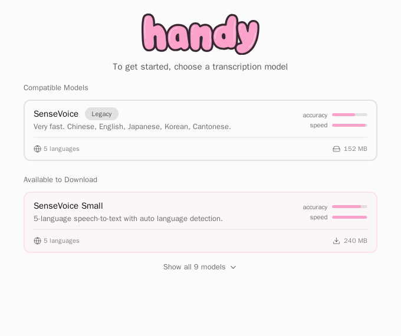

# Atype for Mac（Handy fork）

這是 [Handy](https://github.com/cjpais/Handy) **v0.9.8**（上游 commit `14f6f0d`，2026-10-03）的 fork，用 `git subtree` 匯入到 `apps/mac`，給 Atype 自用的 Mac 版當底。Handy 是 MIT 授權的 Tauri 2 + Rust 語音輸入 App；我們沿用它的全域熱鍵、收據式剪貼簿貼上、Secure Input 偵測、底部 HUD、歷史紀錄、模型下載與 LLM 後處理，只改「中文 / 自用」相關的部分。

對應的計畫在 [`docs/PLAN.md`](../../docs/PLAN.md) §2。

## 和上游的關係

| 事項 | 做法 |
|---|---|
| 匯入 | `git subtree add --prefix=apps/mac https://github.com/cjpais/Handy v0.9.8 --squash` |
| 跟上游 | 上游出新 tag 時：`git subtree pull --prefix=apps/mac https://github.com/cjpais/Handy v0.9.9 --squash`，解衝突、重跑 `bun run build` 與 `cargo test` |
| 原則 | 不碰熱鍵 / 貼上 / Secure Input / HUD / 歷史；Atype 自己的邏輯放在新檔案（`src-tauri/src/atype.rs`），對上游檔案只留一行掛鉤，衝突面才小 |
| 授權 | 保留上游 `LICENSE`（MIT） |

## 剔除了什麼（相對 v0.9.8）

| 類別 | 刪掉的東西 | 原因 |
|---|---|---|
| 介面語言 | 24 個 locale，只留 `en`、`zh-TW` | 自用 |
| 平台 | `nsis/`（Windows 安裝程式）、`tauri.windows.conf.json`、Cargo 的 Windows 相依（`windows`、`webview2-com`、`winreg`）、Windows / Linux 打包設定、Windows Store 圖示、Android / iOS 圖示 | 只做 Mac；Linux 只留「能編譯」當 CI 檢查目標（CPU-only，不需要 Vulkan SDK） |
| 自動更新 | `tauri-plugin-updater`（Rust + 前端 `update-checker`、設定頁的「檢查更新」開關、capabilities、`tauri.conf.json` 的 updater 公鑰與端點） | 原設定會從上游 GitHub Releases 拉更新，把 fork 蓋回 Handy |
| 上游工程 | `.github/`（CI / release）、`nix/`、`flake.*`、`scripts/`（翻譯檢查、Nix、模型鏡像）、Playwright 測試、`AGENTS.md` / `CLAUDE.md` / `CRUSH.md` / `BUILD.md` / `CONTRIBUTING*.md`、`sponsor-images/`、`public/release-notes/` | 與自用無關 |

**刻意沒刪**：Rust 原始碼裡 `#[cfg(windows)]` / `#[cfg(target_os = "linux")]` 的區塊（`clipboard.rs`、`overlay.rs`、`paste_tx/windows.rs` 等）。它們在 macOS 編譯時本來就不會進入二進位；硬刪只會在下次合併上游時製造衝突。

## 改了什麼

| 檔案 | 改動 |
|---|---|
| `src-tauri/src/atype.rs`（新） | 模型白名單與順序：SenseVoice Small（推薦）→ Qwen3-ASR 0.6B → Fun-ASR Nano → Breeze-ASR-25 → Qwen3-ASR 1.7B → Fun-ASR MLT → Whisper large-v3-turbo（對照用）→ Moonshine zh；已在磁碟上的模型一律保留 |
| `src-tauri/src/managers/model.rs` | `get_available_models` 末尾加一行呼叫 `atype::shape_model_list` |
| `src-tauri/src/settings.rs` | 後處理供應商只留 **Gemini**（新增的預設，OpenAI 相容端點）、Anthropic、Groq、Apple Intelligence（Apple Silicon）、Custom；預設供應商 Gemini；預設 prompt 換成 `docs/PLAN.md` §4.2 的 zh-TW「文字濾鏡」；繁簡轉換預設繁體 |
| `src-tauri/src/lib.rs`、`cli.rs` | 移除 updater plugin；視窗標題與 CLI 名稱改 Atype |
| `src-tauri/tauri.conf.json` | `productName` Atype、`identifier` `com.atype.mac`、只打包 `app` + `dmg`、移除 updater |
| `src-tauri/Cargo.toml` | 移除 updater 與 Windows 相依；Linux 的 transcribe-cpp 改 CPU-only |
| `src/i18n/locales/{en,zh-TW}` | 介面文字裡的 Handy → Atype（連結與路徑不動） |
| `package.json` | 移除 playwright、updater、翻譯 / Nix 檢查腳本 |

## 在 Mac 上建置

需求：macOS 14+（Apple `SpeechTranscriber` 引擎之後會要 26+）、Xcode Command Line Tools、Rust stable（`rustup`）、[bun](https://bun.sh)。

```bash
cd apps/mac
bun install
bun run tauri dev          # 開發模式：前端熱更新 + Rust 重編
bun run tauri build        # 產出 src-tauri/target/release/bundle/macos/Atype.app 與 .dmg
```

第一次執行：授權「麥克風」與「輔助使用」；若「系統設定 → 鍵盤 → 按下 🌐 鍵時」是「開始聽寫」，改成「不執行任何操作」，Fn 才能當熱鍵。簽章目前是 ad-hoc（`signingIdentity: "-"`），每次重 build 後輔助使用授權可能要重給；換成固定的 Developer ID 或自簽憑證可避免。

## 在 Linux 上做編譯檢查與無頭測試

Linux 不是目標平台，但可以用來確認 fork 沒編壞，以及用 `--transcribe-file` 跑一段音檔驗證辨識管線（不需要麥克風、不需要桌面）。

```bash
# 系統套件（Debian / Ubuntu）
apt-get install -y libwebkit2gtk-4.1-dev libgtk-3-dev libayatana-appindicator3-dev \
  librsvg2-dev libasound2-dev libxdo-dev libgtk-layer-shell-dev cmake clang

# onnxruntime：ort 2.0.0-rc.12 要 1.24.2；預設會從 cdn.pyke.io 下載，
# 拿不到時改用官方 release 的動態庫
curl -L -o ort.tgz https://github.com/microsoft/onnxruntime/releases/download/v1.24.2/onnxruntime-linux-x64-1.24.2.tgz
tar xzf ort.tgz
export ORT_LIB_LOCATION=$PWD/onnxruntime-linux-x64-1.24.2 ORT_PREFER_DYNAMIC_LINK=1 ORT_SKIP_DOWNLOAD=1

cd apps/mac && bun install && bun run build
cd src-tauri && cargo build && cargo test

# 無頭辨識：模型放在資料目錄的 models/ 下，portable 模式時是 target/debug/Data/
printf 'Handy Portable Mode' > target/debug/portable
mkdir -p target/debug/Data/models/sense-voice-int8     # 放 model.int8.onnx + tokens.txt
LD_LIBRARY_PATH=$ORT_LIB_LOCATION/lib xvfb-run -a target/debug/handy \
  --transcribe-file zh.wav --model sense-voice-int8 --json
```

## 驗證結果（2026-10-03，Linux x86_64 容器，debug build）

| 項目 | 結果 |
|---|---|
| 前端 `tsc && vite build` | 通過，`dist/` 828 KB |
| `cargo build`（Tauri + transcribe-cpp + ort） | 通過，4 分 48 秒（首次、含 whisper.cpp C++ 編譯） |
| `cargo test` | 276 個測試全部通過（`tray_i18n` 的 locale 回退測試已改成只認 en / zh-TW） |
| `cargo fmt --check`、`prettier --check` | 通過 |
| `--list-models` | 11 個：SenseVoice Small [recommended]、Qwen3-ASR 0.6B、Fun-ASR Nano、Breeze-ASR-25、Qwen3-ASR 1.7B、Fun-ASR MLT、Whisper Large v3 Turbo、Moonshine zh ×2、legacy SenseVoice（已安裝）、legacy Breeze |
| `--transcribe-file zh.wav`（SenseVoice int8 ONNX，CPU） | 「開放時間早上9點至下午5點。」5.6 s 音訊 1.56 s 辨識完（約 3.6× 即時），**輸出已是繁體** |
| `--transcribe-file en.wav` | "The tribal chieftain called for the boy and presented him with 50 pieces of code." 7.2 s 音訊 1.98 s |
| `--transcribe-file yue.wav` | 「呢幾個字都表達唔到我想講嘅意思。」5.1 s 音訊 1.52 s（粵語走香港字表） |
| GUI（Xvfb + Vite dev server） | 可開啟；首次啟動的選模型頁如下圖，推薦模型是 SenseVoice Small（240 MB） |



測試音檔與 ONNX 模型來自 sherpa-onnx 的 GitHub release（`sherpa-onnx-sense-voice-zh-en-ja-ko-yue-int8-2024-07-17`）。這裡的辨識速度是**未最佳化的 debug build 跑在容器 CPU 上**，Mac 上 release build + Metal 的 GGUF 模型會快很多。還沒做的驗證：macOS 真機（Fn 熱鍵、Secure Input、貼上、麥克風）、GGUF 模型下載與 Metal 推論、LLM 後處理實際呼叫 Gemini / Claude。

另外還留著的上游痕跡：首頁的 handy 文字 logo（`src/components/icons/HandyTextLogo.tsx`）、About 頁的連結與贊助文字、程式內部的 crate 名稱 `handy`。這些不影響功能，等真機跑順再換。

## 下一步（PLAN §2.2）

1. `AppleSpeech.swift`：macOS 26+ 的 `SpeechTranscriber(zh_TW)` 引擎，接進 transcription manager。
2. `anthropic.rs`：直接打 Claude Messages API（`temperature: 0`、prompt cache、2.5 s 逾時就貼原文）。
3. 確定性層：LLM 輸出後再跑一次 OpenCC `s2twp`（Handy 內建只做 `s2tw`）+ pangu 中英空格 + 全形標點。
4. 拼音別名詞典。
