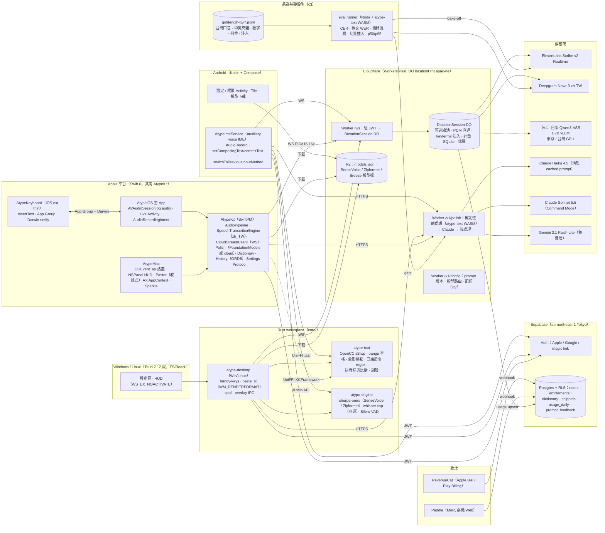

# Atype：品質優先（Quality-first / Chinese-first）方案——以「繁中＋中英夾雜正確率」與「亞秒級延遲」打敗 Typeless 的架構與執行計畫

撰寫日期：2026-10-01。
依據：`scratchpad/research/` 下 11 份研究報告與 `_verification.md`。查核檔已修正的事實（Typeless macOS 預設 `Fn` / `Fn + Left Shift` / `Fn + Space`、**Windows 預設 `Right Alt` 而非 `Ctrl+Win`**）以修正後版本為準；查核檔在第二條（iOS Full Access）中途被截斷，其餘 9 條修正內容不可讀，本文凡涉及那些主題（iOS 鍵盤錄音、STT 數字、LLM 價格、Android/iOS 細節）都回到 Apple / Android / Anthropic 官方文件與 GitHub 原始碼的一手來源，並在附錄 A 列為第 1 週必須重驗的項目。
取向：本文與另外兩份方案（local-first、mvp-first）刻意不同——那兩份以 Tauri 一份碼打三個桌面平台；本文選擇 **macOS 與 iOS 用同一套原生 Swift 管線**、Android 原生 Kotlin、Windows 用 Rust 核心＋Tauri 殼，把工程投資押在「中文品質」與「延遲」這兩個可量測的 KPI 上。

---

## 1. 一段話的論點（Thesis）

Typeless 在台灣的口碑來自「真的能直接送出的繁中文字」，而它被抱怨的是約 3 秒的延遲、偶發簡體、過度濃縮、6 分鐘上限與雲端隱私落差（`typeless-teardown.md` §8；評測 https://readingoutpost.com/typeless/ 、https://www.bnext.com.tw/article/89732/typeless-vs-wisprflow-best-speech-recognition-comparison ）；Wispr Flow 則「設定繁體仍出簡體、中文贅詞不清」（`llm-postprocess.md` §2.1）。這證明**中文市場的勝負在 ASR 之後的 LLM 層與正規化層，而不是 ASR 本身**，而且沒有任何公開基準覆蓋「台灣口音＋中英夾雜＋聽寫短句」（`stt-engines.md` §2.2），所以能自建測試集並據此選引擎、調 prompt、做回歸的團隊就有結構性優勢。本方案把「繁體正確率（簡體洩漏 0、英文術語大小寫 ≥ 98%、台灣口音 CER ≤ 4%）」與「放開按鍵到文字出現 p50 ≤ 0.9 s、p95 ≤ 1.8 s」定成兩個硬性 KPI，用三件事達成：(1) **原生 app**——macOS 與 iOS 共用一套 Swift 管線（`AVAudioEngine` → iOS/macOS 26 `SpeechTranscriber(zh_TW)` 或雲端串流 → 確定性正規化 → LLM 清理 → 注入），Android 原生 Kotlin IME，Windows 用 Rust 核心（直接站在 Handy MIT 碼上）＋Tauri 殼，以取得各平台最短的延遲路徑與最深的整合（Fn 鍵、瀏海 HUD、`SpeechAnalyzer`、`FoundationModels`、`AudioRecordingIntent`）；(2) **以 eval 驅動的中文品質層**——第 1 週就錄 200–500 句台灣口音＋中英夾雜黃金測試集，對 ElevenLabs Scribe v2 Realtime、Deepgram Nova-3 `zh-TW`、Azure、Soniox、Apple `SpeechTranscriber`、SenseVoice-Small、Qwen3-ASR 做 bake-off，並以「OpenCC `s2twp` → LLM（固定殼＋防注入＋繁中 few-shot）→ pangu 中英空格＋全形標點」的確定性三明治保證輸出，個人詞典用拼音相似度做中文別名比對並從使用者修正自動學習；(3) **薄串流後端**——Cloudflare Workers + Durable Objects（`locationHint: "apac-ne"`）只做 WebSocket 代理、預連線、計量與 prompt 版本管理，Supabase（東京）做帳號與權益，API key 絕不下發，並保留在東京／台灣 GPU 自架 Qwen3-ASR-1.7B（Apache-2.0，GigaSpeechBench 普通話 CER 3.95% 優於所有商用 API）的升級路徑以同時壓低延遲、成本與資料出境疑慮。代價是 COGS 高於純本地方案（典型 Pro 用戶約 US$4–5/月），因此 Pro 定價錨在 **US$10/月年繳（NT$320）**、Apple 平台的本地引擎撐免費層；人力現實上，這套「兩套原生」只有在 macOS/iOS 共用 ≥ 70% Swift 碼、Windows 大量借用 Handy、Android 只做語音 IME 不做鍵盤、Linux 延後到 v1.5 的前提下，才是 1–2 人在 3 個月 MVP、6–9 個月 v1 內做得完的。

---

## 2. 各平台技術棧（Per-platform Tech Stack）

### 2.1 總表

| 平台 | 語言 | UI framework | 音訊擷取 | 文字注入 | 熱鍵 / 入口 | STT 引擎（預設 → 備援 → 進階） | LLM 清理 | 打包 / 發行 |
|---|---|---|---|---|---|---|---|---|
| **macOS 13+（26 為完整體驗）** | **Swift 6**（主）＋ Rust `atype-text`（UniFFI XCFramework，純文字正規化，無推論 runtime） | SwiftUI `MenuBarExtra` 設定 + AppKit `NSPanel`（`.nonactivatingPanel`、`.statusBar + 3`、`canJoinAllSpaces` / `fullScreenAuxiliary`）做底部藥丸 / 瀏海 HUD | `AVAudioEngine.inputNode` tap → `AVAudioConverter` 16 kHz mono；常駐暖機引擎 + 0.5 s pre-roll（VoiceVoice 作法）；`kAudioHardwarePropertyDefaultInputDevice` 監聽，預設輸入變藍牙 HFP 時改回內建麥克風 | 剪貼簿 + `CGEvent` ⌘V（`CGEventSource(.privateState)`、`UCKeyTranslate` 佈局感知 keycode）→ **收據式還原**（`declareTypes:owner:` promise + `pasteboard(_:provideDataForType:)` 回執 + `changeCount` 守衛）→ AX 焦點分類（`kAXFocusedUIElementAttribute`；notEditable 只留剪貼簿）；`org.nspasteboard.ConcealedType` 標記；AX 直寫與 Unicode 逐字只作備援 | 自管 `CGEvent.tapCreate(.defaultTap)` 監聽 `flagsChanged`（Fn = keycode 63 + `maskSecondaryFn`、Right ⌥ = 61）；`HoldOrToggle` 300 ms；Secure Input 輪詢 `IsSecureEventInputEnabled()`；預設 **Fn 按住**，無 Apple Fn 鍵改 **Right Option**；第二鍵 Fn+Ctrl = Command Mode | macOS 26：`SpeechTranscriber(locale: zh_TW)`（本地、原生串流、零成本）→ 雲端（Pro）：經自家 DO 代理的 **ElevenLabs Scribe v2 Realtime**（暫定首選）/ Deepgram Nova-3 `zh-TW`（W1 bake-off 定案）→ macOS 13–25：雲端為主，離線用 sherpa-onnx SenseVoice-Small int8（Rust `atype-engine`）→ v1 進階本地：WhisperKit CoreML 跑 **Breeze-ASR-25**（台灣華語＋中英夾雜微調） | 雲端：`claude-haiku-4-5`（清理，固定 ≥4,096 token 可快取 system prompt）/ `claude-sonnet-5-5`（Command Mode 改寫）/ Gemini 3.1 Flash-Lite（免費層 fast tier）；本地：macOS 26 `FoundationModels`（≤300 token prompt，`supportsLocale(zh-TW)` 執行期檢查） | Developer ID + Hardened Runtime + `notarytool` + `stapler`；Sparkle 2（EdDSA）；DMG + Homebrew cask；**不上 Mac App Store** |
| **Windows 10/11（x64 + ARM64）** | **Rust**（核心：熱鍵、貼上、音訊、引擎）＋ **TypeScript/React**（Tauri 2.12.x 殼：設定頁、HUD） | Tauri 2.12.x；HUD 為 `WS_EX_NOACTIVATE \| WS_EX_TOOLWINDOW` 透明 topmost 視窗 | `cpal 0.16`（WASAPI）+ `rubato` 16 kHz + `rtrb` ring buffer；Silero VAD（`vad-rs`）；COM 在自家 `CoInitializeEx(COINIT_MULTITHREADED)` 執行緒；錄音時 GSMTC 暫停媒體 | 剪貼簿 + `SendInput` Ctrl+V（`VK_V` 0x56、Ctrl 按住 100 ms）→ **收據式還原**（`SetClipboardData(CF_UNICODETEXT, NULL)` 延遲渲染 + `WM_RENDERFORMAT` + `GetClipboardSequenceNumber`）→ `KEYEVENTF_UNICODE`（短文 / 使用者指定）→ UIPI（管理員視窗）偵測後「已複製，請 Ctrl+V」；終端 Ctrl+Shift+V；IME 組字中改走貼上 | `handy-keys 0.3.4`（`WH_KEYBOARD_LL`，回呼只投遞 channel、`LLKHF_INJECTED` 過濾自家事件）；預設 **Right Ctrl 按住**，備選 **Right Alt**（查核檔確認為 Typeless Windows 官方預設，給遷移者）與 Ctrl+Win（Wispr 預設）；單一修飾鍵一律 `HoldOrToggle` | 雲端（同 macOS）→ 本地：sherpa-onnx **SenseVoice-Small int8**（CPU，非自迴歸，AISHELL-1 CER 2.96）+ streaming Zipformer bilingual zh-en（HUD 即時預覽）→ ARM64 一律 CPU（QNN NPU 延後） | 雲端（同上）；v1 本地：llama.cpp Qwen3-1.7B Q4（可選） | Tauri NSIS per-user（x64 + ARM64）+ `tauri-plugin-updater`（minisign）；Azure Artifact (Trusted) Signing（台灣可用性 W1 驗證，否則 OV 憑證）；winget |
| **Linux（v1.5，nice-to-have）** | 同 Windows（Rust 核心 + Tauri 殼） | Tauri；Linux 預設關閉 overlay（Handy 的教訓） | `cpal` ALSA/PipeWire | X11：剪貼簿 + `xdotool` Ctrl+V；Wayland：KDE `kwtype` / wlroots `wtype`；GNOME Wayland 缺 data-control 時降級「已複製」；中文**不走**鍵碼逐字 | X11：`global-hotkey`；Wayland：`org.freedesktop.portal.GlobalShortcuts`（`ashpd`，`Activated`/`Deactivated` 做 PTT）；保底 CLI `atype --toggle` | 同 Windows 本地 / 雲端 | 同上 | AppImage + deb；Flatpak 延後 |
| **iOS 17+（26 為完整體驗）** | **Swift 6**（主 App + Keyboard Extension；與 macOS 共用 `AtypeKit` Swift Package：音訊管線、`SpeechTranscriber` 引擎、雲端串流 client、正規化、詞典、歷史、設定、協定） | SwiftUI 主 App；鍵盤 extension 用 UIKit 手刻 thin client（常駐 < 30 MB、峰值 < 45 MB、不含任何 ML / 推論 runtime） | 主 App：`AVAudioSession(.playAndRecord)`（**類別必須在前景設定**）+ `UIBackgroundModes: audio`；鍵盤 **不錄音**（Apple 文件明載 extension 無麥克風） | 鍵盤 `textDocumentProxy.insertText`（`setMarkedText` 做 ghost text）；App Group `UserDefaults` + Darwin notification 交接；raw 先落地再潤飾 | 鍵盤麥克風鍵（`extensionContext.open(url)` 冷啟動 / session 存活時只寫 App Group）；`AudioRecordingIntent` + `ControlWidget`（Action Button / Control Center）+ Live Activity | iOS 26：`SpeechTranscriber(zh_TW)`（系統模型、零 App 記憶體）→ 雲端串流（Pro / iOS 17–18 主路徑）→ `DictationTranscriber` 第三層 | iOS 26 + Apple Intelligence：`FoundationModels`（4,096 token 含輸出，`supportsLocale` 檢查）→ 雲端中繼 | App Store（TestFlight 內部 100 / 外部 10,000）；兩個 target 各一份 `PrivacyInfo.xcprivacy`；4.4.1：無 Full Access 也要能打字（內建最小英文鍵盤）與插字；送審備註說明 extension 無麥克風故開啟 containing app；StoreKit 2 + RevenueCat |
| **Android 8+（targetSdk 36）** | **Kotlin** + Jetpack Compose（IME 必須原生）＋ `atype-text`（UniFFI `.aar`）＋ sherpa-onnx 官方 Kotlin API | Compose in `InputMethodService`（FlorisBoard `LifecycleInputMethodService` 範式：自裝三個 ViewTree owner） | IME 可見時直接 `AudioRecord(VOICE_RECOGNITION, 16000, MONO, PCM_16BIT)`，**不啟 foreground service**；權限經透明 Activity | `setComposingText`（partial 灰字）→ `beginBatchEdit` + `finishComposingText` + `commitText` 定稿 → `switchToPreviousInputMethod()`（API 28）+ Sayboard 式 fallback；密碼欄拒絕辨識；**不做** AccessibilityService 注入 | `method.xml`：`imeSubtypeMode="voice"` + `isAuxiliary="true"`（HeliBoard / FlorisBoard / SwiftKey 麥克風鍵可交接）；Quick Settings Tile；`RECOGNIZE_SPEECH` Activity；Gboard / Samsung 不交接 → Tile + 地球鍵引導 | 雲端串流（Pro 主路徑）→ 本地 sherpa-onnx SenseVoice int8 228 MB（首次下載）→ v1 加 streaming Zipformer small（≈47 MB）做即時灰字 → `createOnDeviceSpeechRecognizer()`（API 31）作「模型未下載」fallback | 本地只做 `atype-text` 規則層（Gemini Nano Prompt API 不支援 zh-TW）→ 雲端中繼 | Google Play（Billing Library 9；個人帳號 closed testing 12 人 × 14 天，待驗證）；`.so` 16 KB page 對齊（NDK r28+）；模型走 R2 下載；Data safety + prominent disclosure |
| **後端 / 共享核心** | **TypeScript**（Cloudflare Workers + DO；開發者強項）、SQL（Supabase）、Rust `atype-text`（同一份正規化碼編成 XCFramework / AAR / WASM 給 Worker 與 eval 用） | — | — | — | — | DO 代理：ElevenLabs Scribe v2 Realtime（<150 ms、$0.39/hr、普通話 CER 5.24% 商用最佳）/ Deepgram Nova-3 `zh-TW`（$0.29–0.46/hr）；v1 自架 **Qwen3-ASR-1.7B**（vLLM 串流 WER 2.84、Apache-2.0）於東京 / 台灣 GPU | Anthropic（預設不保留對話內容）+ Gemini 3.1 Flash-Lite；prompt 版本化於 `packages/prompts` | Workers Paid US$5/月 + DO（`apac-ne`）；Supabase Tokyo（Auth / Postgres / RLS）；R2（模型檔 + `models.json`）；Paddle（MoR）+ Apple IAP + Play Billing，RevenueCat 統一 entitlement，單一真相在自家 Postgres |

### 2.2 選型理由（逐項對應研究證據）

**為什麼 macOS 與 iOS 走原生 Swift，而不是 Tauri 一份碼打三平台**
- 品質優先的三個關鍵 API 都是 Swift-only：`SpeechAnalyzer` / `SpeechTranscriber`（iOS/macOS 26，完全端上、原生串流 volatile/final、`supportedLocales` 含 `zh_TW / zh_HK / yue_CN`、模型存於系統不佔 app 記憶體）https://developer.apple.com/documentation/speech/speechanalyzer 、https://developer.apple.com/videos/play/wwdc2025/277/ 、實機 locale 清單 https://github.com/bitwize-ai/Logue/issues/41 ；`FoundationModels`（4,096 token context，支援繁中）https://developer.apple.com/documentation/technotes/tn3193-managing-the-on-device-foundation-model-s-context-window ；`AudioRecordingIntent` + `ControlWidget` + `ActivityKit` https://developer.apple.com/documentation/appintents/audiorecordingintent （`ios-keyboard.md` §5–6、`stt-engines.md` §2.3）。Tauri 要用這些得逐一寫 Swift FFI；而 iOS 鍵盤與主 App 本來就必須是 Swift（Tauri 無 app extension 概念，issue #15663 顯示內嵌 extension 在 CI 簽章會丟 entitlements）https://github.com/tauri-apps/tauri/issues/15663 （`backend-architecture.md` §1.2）。既然 iOS 一定要寫一套 Swift 管線，**讓 macOS 直接共用它**比再維護一套 Rust/TS 管線更省——這是本方案與另兩份的核心分歧。
- macOS 體驗上限：VoiceInk（原生 Swift）示範了瀏海 HUD（`NotchRecorderPanel.swift`）、AUHAL 指定裝置、MediaRemote 暫停媒體、`ShortcutMonitor` 的純修飾鍵「1 秒內按其他鍵即不觸發」邏輯 https://github.com/Beingpax/VoiceInk/tree/main/VoiceInk/Infrastructure/SystemIntegration ；VoiceVoice 的 `TextInserter.swift` 三層瀑布與 AX 焦點分類 https://github.com/sergekruf/voicevoice/blob/main/Sources/VoiceVoice/Services/TextInserter.swift （`desktop-macos.md` §1.4、§3.2、§5.1）。這些都是 Swift，可直接參考（VoiceInk 為 GPL-3，只學思路不抄碼；VoiceVoice、Blurt 為 MIT）。
- Electron 的 `globalShortcut` 沒有 key-up（push-to-talk 不可行）、Flutter `hotkey_manager` key-up 只在 macOS 有效 https://raw.githubusercontent.com/electron/electron/main/docs/api/global-shortcut.md 、https://github.com/leanflutter/hotkey_manager （`desktop-macos.md` §6）。

**為什麼 Windows 是 Rust 核心＋Tauri 殼（而非 C#/WinUI 或再一套原生）**
- Handy（Rust + Tauri 2.11.5，MIT，32.5k★，v0.9.7 於 2026-09-18）已解掉 Windows 三個最難的問題並開源：`handy-keys` 低階鉤子（純修飾鍵、擋鍵、`LLKHF_INJECTED`）、`paste_tx/windows.rs` 的 `WM_RENDERFORMAT` 收據式貼上、`cpal` + COM 執行緒陷阱 https://github.com/cjpais/Handy 、https://github.com/handy-computer/handy-keys 、https://github.com/cjpais/Handy/blob/main/src-tauri/src/paste_tx/windows.rs （`desktop-windows-linux.md` §1.2、§2.2）。開發者的強項是 TypeScript，Tauri 讓設定頁與 HUD 用 React 寫；Rust 核心同時給 Android 用（sherpa-onnx、正規化）。
- `RegisterHotKey` 無放開事件、不能綁單一修飾鍵；`WH_KEYBOARD_LL` 回呼 Win10 1709 起 1000 ms 逾時會被靜默移除 https://github.com/MicrosoftDocs/win32/blob/docs/desktop-src/winmsg/lowlevelkeyboardproc.md （`desktop-windows-linux.md` §2.1）。`SendInput` 受 UIPI 限制且無錯誤碼 https://github.com/MicrosoftDocs/sdk-api/blob/docs/sdk-api-src/content/winuser/nf-winuser-sendinput.md 。

**為什麼 STT 首選是「雲端串流 bake-off + Apple 本地」而不是 Whisper**
- Whisper 家族對 zh-TW 有簡繁混出、`large-v3-turbo` 幻覺 FIC 1601 vs 124、聲調語言退步 https://github.com/openai/whisper/discussions/277 、https://arxiv.org/pdf/2502.12414 ；GigaSpeechBench 普通話 CER：FunASR-realtime 3.12 / Qwen3-ASR-1.7B 3.95 / **ElevenLabs Scribe v2 5.24** / Azure 5.92 / Gemini 3.0 Flash 8.79 / Whisper-large-v3 9.83 / GPT-4o-transcribe 15.29 https://github.com/SpeechColab/GigaSpeechBench （`stt-engines.md` §2.2）。品質優先 ⇒ 商用 API 選 Scribe v2 Realtime（<150 ms）https://elevenlabs.io/realtime-speech-to-text ，並規劃自架 Qwen3-ASR-1.7B https://github.com/QwenLM/Qwen3-ASR （Apache-2.0；vLLM 串流 WER 2.84）。
- Deepgram Nova-3 於 2026-03-31 加入 `zh-TW` https://developers.deepgram.com/changelog/2026/3/31 ，但 `language=multi` code-switching **不含中文** https://github.com/orgs/deepgram/discussions/1097 ——中英夾雜要靠 `zh-TW` 單語模式順便辨出英文，品質必須實測；故列為第二候選而非首選。
- Apple `SpeechTranscriber` 中文 CER 7.97 ≈ Whisper turbo（第三方測試 https://whispernotes.app/blog/apple-speech-vs-whisper ），不如雲端，但零成本、零下載、原生串流、`zh_TW` 明確以繁體為輸出目標——作為 **免費層與離線 fallback** 恰到好處（`business-privacy-store.md` §6）。
- 本地中文：SenseVoice-Small AISHELL-1 CER 2.96、int8 ~230 MB、非自迴歸（CPU 筆電可即時）https://github.com/FunAudioLLM/SenseVoice 、https://github.com/k2-fsa/sherpa-onnx ；Parakeet TDT 0.6B v3 **無中文**（`backend-architecture.md` §3.2）；Breeze-ASR-25（MIT）CSZS 中英夾雜 WER 29.49 → 13.01 https://github.com/mtkresearch/Breeze-ASR-25 ，但 Whisper-large 體積，只適合桌機進階模式。

**為什麼 LLM 是 Haiku 4.5（清理）+ Sonnet 5.5（改寫）而非更強或更便宜的模型**
- 中文差異在 LLM 層；Handy issue #1261 證實 prompt injection 是真實 bug 且「模型越笨越容易被注入」https://github.com/cjpais/Handy/issues/1261 ；Claude 系列繁中強、指令遵守好（`llm-postprocess.md` §4.2 觀察）。Haiku 4.5 `$1/$5`、Sonnet 5.5 `$2/$10`、cache 讀分別 `$0.10` / `$0.20`，Haiku 最小可快取 4,096 token、Sonnet 512 token https://platform.claude.com/docs/en/about-claude/pricing 、https://platform.claude.com/docs/en/build-with-claude/prompt-caching 。本方案刻意把 Haiku 的 system prompt（規則＋few-shot＋台灣用語對照表）灌到 ≥ 4,096 token 以命中 cache：4,100 × $0.10/M ≈ $0.00041 < 1,100 × $1/M ≈ $0.0011，**更便宜也更穩**（`llm-postprocess.md` §5.5 第 3 點），W3 實測 TTFT 是否受影響。
- 刻意**不用** `claude-opus-5-5` 做每句清理：Opus 5.5 無法關閉 thinking、`$4/$20`，對「50 字清理、0.6–1.2 s 預算」的工作是錯的工具；Sonnet 5.5 用於 Command Mode（使用者預期它在「思考」，允許 3–4 s），以 `output_config: { effort: "low" }` 控制延遲，並處理 `stop_reason == "refusal"` 時貼原文。Gemini 2.5 Flash-Lite 將於 2026-10-16 關閉，**不新接**；3.1 Flash-Lite（$0.25/$1.50）作免費層 fast tier（`llm-postprocess.md` §4.2）。
- 本地 LLM：Apple Foundation Models 可用但 4,096 token 含輸出、prompt 必須 ≤ 300 token；Android Gemini Nano Prompt API 只驗證英/韓、輸出 256 token 上限 ⇒ Android 本地只做規則層（`llm-postprocess.md` §4.4–4.5）。

**為什麼手機端是「薄原生 client」**
- iOS：Apple 文件「Custom keyboards… have no access to the device microphone, so dictation input is not possible」https://developer.apple.com/library/archive/documentation/General/Conceptual/ExtensibilityPG/CustomKeyboard.html ；Full Access 開放清單無麥克風 https://developer.apple.com/documentation/uikit/configuring-open-access-for-a-custom-keyboard ；記憶體上限社群實測 30–60 MB（Dictus #555）https://github.com/getdictus/dictus-ios/issues/555 ；4.4.1 要求無 Full Access 仍可用 https://developer.apple.com/app-store/review/guidelines/ （`ios-keyboard.md` §2、§7）。
- Android：IME 是唯一正規插字管道；FUTO Voice Input 的 `setComposingText` / `commitText` / `switchToPreviousInputMethod` 與 `isAuxiliary="true"` voice subtype 範式 https://github.com/futo-org/voice-input 、https://developer.android.com/develop/ui/views/touch-and-input/creating-input-method ；Gboard / Samsung 麥克風鍵硬編碼不交接（FUTO README）；AccessibilityService 注入有 Play 審核風險（`android-ime.md` §3、§6）。

**為什麼後端是 Cloudflare DO + Supabase Tokyo**
- DO 休眠免計 GB-s、WebSocket 訊息 20:1 計價、`locationHint: "apac-ne"`（best effort）；Supabase Edge Functions 有東京 / 新加坡、無香港；Edge Functions 不適合長連線 ⇒ 串流交給 DO https://github.com/cloudflare/cloudflare-docs/blob/production/src/content/docs/durable-objects/best-practices/websockets.mdx 、https://github.com/cloudflare/cloudflare-docs/blob/production/src/content/docs/durable-objects/reference/data-location.mdx 、https://github.com/supabase/supabase/blob/master/apps/docs/content/guides/functions/regional-invocation.mdx （`backend-architecture.md` §2.2–2.3）。
- 隱私標籤：Anthropic 預設不保留對話內容（ZDR 需 sales）、Deepgram 預設不存音訊 https://platform.claude.com/docs/en/manage-claude/api-and-data-retention （`business-privacy-store.md` §5.2）。Typeless 因「on-device」行銷與實際送 AWS us-east-2 的落差被抓包 https://www.getvoibe.com/resources/typeless-privacy-issues/ ——我們的文案區分「辨識在哪」與「資料存在哪」，且上下文只送游標前 300 字、**不送視窗標題 / URL**。

---

## 3. 系統架構圖（含後端）



資料流（雲端模式，macOS）：熱鍵按下 → `AudioPipeline` 從 0.5 s pre-roll 環形緩衝開始送 PCM → 同一瞬間 `CloudStreamClient` 對已暖的 DO 連線送 `start`（DO 開上游 Scribe Realtime，含本次候選 keyterms）→ partial 進 HUD、final 累積 → 放開熱鍵送 `stop` → DO `finalize` 回最後一段 → `atype-text` 前處理（OpenCC、指令、詞典）→ `/v1/polish`（Haiku，逾時 2.0 s）→ `atype-text` 後處理 → `Paster` 一次貼上 → 歷史落地（raw + polished + app + mode）。本地模式只是把 DO 換成 `SpeechTranscriber`，其餘不變。

---

## 4. Monorepo 佈局

```
atype/
├─ apple/                              # Xcode workspace（Swift 6, strict concurrency）
│  ├─ Packages/AtypeKit/               # ★ macOS 與 iOS 共用（目標 ≥ 70% 程式碼）
│  │  ├─ Sources/Audio/                #   AudioPipeline（AVAudioEngine tap → 16k mono, pre-roll ring）、LevelMeter、DeviceGuard(mac)
│  │  ├─ Sources/STT/                  #   protocol SttEngine { start/feed/partial/final/stop }；SpeechTranscriberEngine、CloudStreamEngine、DictationTranscriberEngine
│  │  ├─ Sources/Polish/               #   PolishPipeline：pre(atype-text) → LLM(cloud|FoundationModels) → post(atype-text)；逾時與 fallback
│  │  ├─ Sources/Dictionary/           #   DictionaryStore、AliasMatcher(呼叫 atype-text)、AutoLearn（diff → LLM judge）
│  │  ├─ Sources/History/              #   GRDB SQLite（raw/polished/app/mode/latency）、保留期
│  │  ├─ Sources/Protocol/             #   由 packages/protocol 產生的 Codable 型別
│  │  └─ Sources/Settings/             #   settings.schema 的 Swift 映射
│  ├─ Packages/AtypeTextFFI/           #   UniFFI 產生的 Swift binding + AtypeText.xcframework（binary target）
│  ├─ AtypeMac/                        # menubar app：HotkeyTap、Paster、FocusClassifier(AX)、HUDPanel、AppContext、SecureInputWatch、SparkleUpdater、Onboarding
│  ├─ AtypeiOS/                        # 主 App：DictationSession、ColdStartLaunch、LiveActivityManager、Onboarding、Paywall(StoreKit2)
│  ├─ AtypeKeyboard/                   # UIInputViewController thin：MicKey、MinimalEnglishKeyboard(4.4.1)、HandoffReader、LifecycleProbe
│  ├─ AtypeWidgets/                    # ControlWidget（Action Button / Control Center）、Live Activity UI、AudioRecordingIntent
│  └─ fastlane/                        # match、TestFlight、notarize(mac)
├─ core/                               # Rust workspace（edition 2024）
│  ├─ atype-text/                      # ★ 唯一的中文正規化實作：OpenCC(ferrous-opencc) s2twp/s2hk、pangu 空格、全形標點、口語指令、拼音別名比對、剝殼；no I/O
│  ├─ atype-engine/                    # sherpa-onnx 官方 crate（SenseVoice / Zipformer / Silero VAD）；feature "whisper" → transcribe-cpp（Breeze-ASR-25）
│  ├─ atype-desktop/                   # Windows/Linux：handy-keys 熱鍵狀態機、paste_tx(Handy MIT 改寫)、cpal 音訊、UIPI/IME 偵測、overlay IPC
│  └─ atype-ffi/                       # uniffi-bindgen-swift（XCFramework）、uniffi kotlin（.aar）、wasm-pack（給 Worker 與 eval）
├─ desktop-win/                        # Tauri 2.12.x 殼（React + Vite）：設定頁、HUD、tray、updater；src-tauri 依賴 atype-desktop
├─ android/                            # Gradle：app（設定 / 權限 / Tile / 模型下載）+ ime（AtypeImeService, Compose）+ core-android（.aar）
├─ backend/
│  ├─ worker/                          # Cloudflare Workers + DO（TS, wrangler）：/ws、/v1/polish、/v1/config、/v1/usage、webhooks
│  ├─ supabase/                        # migrations、RLS policies、entitlement 視圖
│  └─ asr-server/                      # (v1) vLLM + Qwen3-ASR-1.7B 的 docker compose、健康檢查、OpenAI 相容串流端點
├─ packages/
│  ├─ protocol/                        # WS/HTTP 協定 JSON Schema → quicktype 產 TS / Swift / Kotlin / Rust
│  ├─ prompts/                         # zh-TW 清理 prompt 版本（stable_v*.md ≥ 4,096 token、local_v*.md ≤ 300 token）、task 區塊、few-shot
│  └─ eval/                            # golden/*.jsonl、metrics.ts（CER/WER/簡體洩漏/幻覺）、runners（stt-bakeoff.ts、llm-bakeoff.ts、latency.ts）
├─ infra/                              # models.json manifest、R2 上傳、簽章腳本（notarize.sh、trusted-signing.ps1）
└─ .github/workflows/                  # apple.yml（path filter: apple/**, core/**）、win.yml、android.yml、worker.yml、eval.yml（PR gate）
```

- **一份正規化碼、四個產物**：`atype-text` 編成 XCFramework（Apple）、AAR（Android）、靜態 lib（Windows）、WASM（Worker 與 eval）。這保證「桌機上看到的繁體與空格規則」與「後端 eval 量到的」是同一段碼；UniFFI v0.32.1 支援 `&[u8]` 零拷貝與 proc-macro https://github.com/mozilla/uniffi-rs/blob/main/CHANGELOG.md 。
- 不放進共享核心的東西：UI、熱鍵、注入、鍵盤 UI（每個平台都不同，硬共享只會更慢；`backend-architecture.md` §1.3）。
- `whisper-rs`（2025-07 封存）與 `sherpa-rs`（2026-06 封存）**不用**；用 sherpa-onnx 官方 Rust crate 與 `transcribe-cpp` https://github.com/thewh1teagle/sherpa-rs 、https://github.com/k2-fsa/sherpa-onnx/tree/master/rust-api-examples 。
- Tauri 鎖 2.12.x（3.0.0-alpha.4 已出，待穩定再遷）。

---

## 5. 五個最難的技術問題與解法

### 5.1 繁體中文＋中英夾雜的品質保證：引擎選型、確定性三明治、prompt、詞典、eval

**問題**：沒有引擎原生保證繁體（Whisper 系簡繁混出；SenseVoice / Paraformer 以簡體語料訓練；雲端 API 的 script 參數不明），中文贅詞（「然後 / 就是 / 對」有實義時要保留）只能靠 LLM，而 LLM 又會被口述內容注入（Handy #1261）、把 Costco 翻成中文、吐簡體、加前言。沒有公開基準能告訴我們哪個引擎在台灣口音 + 中英夾雜上最好（`stt-engines.md` §2.2 附註）。

**解法（五層）**

**(a) 第 1 週建黃金測試集，之後所有決策靠數字。** `packages/eval/golden/zh-tw-v1.jsonl`，200 句起、v1 擴到 500 句，每筆：

```jsonc
{ "id": "tw-0137", "audio": "r2://golden/tw-0137.wav", "speaker": "f-30s-taipei", "env": "office",
  "ref_raw":  "呃我們那個 PR 我已經 merge 了然後 staging 的 API 大概十分鐘後會 deploy 完",
  "ref_clean": "我們那個 PR 我已經 merge 了，staging 的 API 大概 10 分鐘後會 deploy 完。",
  "tags": ["code-switch", "filler", "number", "tech-term"],
  "terms": ["PR", "merge", "staging", "API", "deploy"] }
```
指標（`metrics.ts`，正規化後計算）：中文 **CER**（先經 `atype-text` 統一繁體、去空格與標點再比）、英文詞 **WER** 與**大小寫正確率**、**簡體洩漏率**（輸出中出現 OpenCC `t2s` 後會變化的字 → 視為簡體）、**幻覺插入字數**（靜音 / 音樂 / 咳嗽 30 段）、贅詞移除 precision/recall（對 `ref_clean`）、**注入通過率**（20 句「忽略以上指令…」必須被當內容整理）。這對應 `stt-engines.md` §5 的 E1–E6。

**(b) STT bake-off 在 W1–W2 跑完，候選**：ElevenLabs Scribe v2 Realtime、Deepgram Nova-3 `zh-TW`、Azure `zh-TW`、Soniox v5、Alibaba `qwen3-asr-flash-realtime`（只為量品質上限，資料落地新加坡 / 北京，**不採用**）、Apple `SpeechTranscriber zh_TW`（macOS 26 實機）、sherpa-onnx SenseVoice-Small int8、Qwen3-ASR-1.7B（vLLM，自架候選）、Breeze-ASR-25（whisper.cpp Metal）。決策規則：雲端首選 = 中英夾雜 CER + 英文 WER 綜合最低且 p50 finalize ≤ 400 ms；本地 = 各平台可跑者中最佳。研究已知的先驗：Scribe v2 普通話 CER 5.24% 為商用最佳、Qwen3-ASR-1.7B 3.95%、SenseVoice-Small AISHELL-1 2.96（`stt-engines.md` §2.2），但這些都不是台灣口音；**不要在 bake-off 前決定**。

**(c) 確定性三明治——繁體與排版不交給機率模型。** `core/atype-text/src/lib.rs`（依 Handy 的 `ferrous-opencc 0.2.3` 用法與 OpenCC 官方 `s2twp` 配置 https://github.com/BYVoid/OpenCC ；crate API 以其文件為準）：

```rust
use ferrous_opencc::{OpenCC, config::BuiltinConfig};
use once_cell::sync::Lazy;
use regex::Regex;

static S2TWP: Lazy<OpenCC> = Lazy::new(|| OpenCC::from_config(BuiltinConfig::S2twp).expect("opencc"));
static S2HK:  Lazy<OpenCC> = Lazy::new(|| OpenCC::from_config(BuiltinConfig::S2hk).expect("opencc"));
// 「盤古之白」：中文與英數之間一個半形空格；全形標點前後不加；% 與 ° 不加（sparanoid 文案排版指北）
static CJK_THEN_LATIN: Lazy<Regex> = Lazy::new(|| Regex::new(r"(\p{Han})([A-Za-z0-9@$\[(])").unwrap());
static LATIN_THEN_CJK: Lazy<Regex> = Lazy::new(|| Regex::new(r"([A-Za-z0-9!\])])(\p{Han})").unwrap());
static ZERO_WIDTH:     Lazy<Regex> = Lazy::new(|| Regex::new("[\u{200B}\u{200C}\u{200D}\u{FEFF}]").unwrap());
static DUP_PUNCT:      Lazy<Regex> = Lazy::new(|| Regex::new(r"([，。！？；：])\1+").unwrap());
static LLM_SHELL:      Lazy<Regex> = Lazy::new(|| Regex::new(r"(?s)^\s*(以下是[^：:\n]*[：:]\s*|Here is[^:\n]*:\s*|`{3}\w*\n)|(`{3}\s*)$").unwrap());   // 剝掉前言與 code fence

#[derive(uniffi::Record, Clone)]
pub struct NormalizeOptions {
    pub script: Script,              // TaiwanTraditional | HongKongTraditional | AsIs
    pub cjk_latin_space: bool,       // 預設 true
    pub fullwidth_punct: bool,       // 中文句用「，。？！：；」；英文片段內保留半形
    pub strip_llm_shell: bool,       // 剝掉 LLM 前言 / code fence / 引號
}

#[uniffi::export]
pub fn normalize(input: &str, o: &NormalizeOptions) -> String {
    let mut s = ZERO_WIDTH.replace_all(input, "").into_owned();
    if o.strip_llm_shell { s = LLM_SHELL.replace_all(&s, "").trim().to_string(); }
    s = match o.script {
        Script::TaiwanTraditional => S2TWP.convert(&s),   // 鼠标→滑鼠、软件→軟體、視頻→影片…
        Script::HongKongTraditional => S2HK.convert(&s),
        Script::AsIs => s,
    };
    if o.fullwidth_punct { s = fullwidth_in_cjk_context(&s); }   // 只在前後至少一側是漢字時把 , . ? ! : ; 轉全形
    if o.cjk_latin_space {
        s = CJK_THEN_LATIN.replace_all(&s, "$1 $2").into_owned();
        s = LATIN_THEN_CJK.replace_all(&s, "$1 $2").into_owned();
        // 例外：15%、30°、全形標點旁 → 由 fullwidth_in_cjk_context 保證不插空格
    }
    DUP_PUNCT.replace_all(&s, "$1").into_owned()
}

/// 口語指令：在送 LLM 之前以 regex 攔截（零延遲、可靠），LLM 只負責語意分段
#[uniffi::export]
pub fn apply_spoken_commands(input: &str, mode: PunctMode) -> String {
    const CMDS: &[(&str, &str)] = &[("新段落", "\n\n"), ("換行", "\n"), ("句號", "。"), ("逗號", "，"),
                                    ("問號", "？"), ("驚嘆號", "！"), ("冒號", "："), ("分號", "；"),
                                    ("左引號", "「"), ("右引號", "」")];
    if mode == PunctMode::Off { return input.to_string(); }
    let mut s = input.to_string();
    for (w, r) in CMDS { s = s.replace(&format!(" {w} "), r).replace(&format!(" {w}"), r).replace(&format!("{w} "), r); }
    s
}
```
（`fullwidth_in_cjk_context` 的規則表來自 https://github.com/sparanoid/chinese-copywriting-guidelines ，pangu 的語意例外 https://github.com/vinta/pangu.js 。Handy 的 `maybe_convert_chinese_variant()` 證明「依實際輸出語言 gate OpenCC、避免誤轉日文漢字」是必要的——我們以引擎回報的 language tag 或 `whatlang` 做 gate。）

OpenCC `s2twp` 的詞彙級轉換可能誤改使用者刻意說的大陸用語或專有名詞（`llm-postprocess.md` §7 第 5 點）——因此詞典條目**豁免**轉換（先把 known terms 以占位符保護，轉換後還原），且設定提供「只轉字（`s2tw`）不轉詞」。

**(d) LLM 清理 prompt：VoiceInk 的「固定殼＋可換任務＋標籤上下文」＋ Whispering 的「你是文字濾鏡」防注入句＋繁中 few-shot。** 穩定前綴（`packages/prompts/stable_v1.md`）依 `llm-postprocess.md` §5.2 的 10 條規則與 5 個範例起手，再加「台灣用語對照表」與 60–80 條 few-shot 把長度灌到 ≥ 4,096 token（Haiku 快取門檻）；可變區塊（`<task mode>`、`<known_terms>`、`<context_before>`、`<selected_text>`）放在 cache 斷點之後；user message 固定 `<transcript>…</transcript>`。Worker 端（`backend/worker/src/polish.ts`，官方 `@anthropic-ai/sdk`）：

```ts
import Anthropic from "@anthropic-ai/sdk";
import { normalize, applySpokenCommands } from "./atype_text_wasm";   // 同一份 Rust 碼
import { PROMPTS } from "@atype/prompts";

export async function polish(env: Env, req: PolishRequest, signal: AbortSignal): Promise<PolishResponse> {
  const pre = applySpokenCommands(normalize(req.text, { script: req.script, cjkLatinSpace: false, fullwidthPunct: false, stripLlmShell: false }), req.punct);
  if (shouldSkipLlm(pre)) return { text: post(pre, req), usedLlm: false };          // ≤3 詞、純 URL/代碼、純指令 → 不呼叫

  const client = new Anthropic({ apiKey: env.ANTHROPIC_API_KEY });
  const stream = client.messages.stream({
    model: "claude-haiku-4-5",
    max_tokens: 512,                                   // 50–200 字清理；避免拖長
    system: [
      { type: "text", text: PROMPTS.zhTW.stable, cache_control: { type: "ephemeral" } },   // ≥ 4,096 token → 命中 cache
      { type: "text", text: buildVariableBlocks(req) },                                   // <task> <known_terms> <context_before>
    ],
    messages: [{ role: "user", content: `<transcript>\n${pre}\n</transcript>` }],
  }, { signal });                                      // 客戶端逾時 2.0 s 時中止
  const msg = await stream.finalMessage();
  if (msg.stop_reason === "refusal" || msg.stop_reason === "max_tokens") return { text: post(pre, req), usedLlm: false };
  const out = msg.content.filter(b => b.type === "text").map(b => b.text).join("");
  if (!sane(out, pre)) return { text: post(pre, req), usedLlm: false };               // 長度膨脹 > 2×、含「以下是」前綴、空輸出 → 視為失敗
  return { text: post(out, req), usedLlm: true, cacheHit: (msg.usage.cache_read_input_tokens ?? 0) > 0 };
}
const post = (s: string, r: PolishRequest) => normalize(s, { script: r.script, cjkLatinSpace: r.pangu, fullwidthPunct: true, stripLlmShell: true });
```
Command Mode（選取文字 + 口述指令）改用 `model: "claude-sonnet-5-5"`、`output_config: { effort: "low" }`（Sonnet 5.5 不接受 `thinking: {type:"disabled"}`；低 effort 已足夠且保留判斷力），`<selected_text>` 作來源、`<transcript>` 作指令，並同樣檢查 `stop_reason === "refusal"`（Sonnet 5.5 有安全分類器）。`usage.cache_read_input_tokens` 在 W3 的 bake-off 中必須 > 0，否則表示前綴有靜默失效（時間戳、未排序 JSON）。

**(e) 中文詞典真的要能用。** Handy 的 Levenshtein + Soundex 明寫「not suitable for CJK」。我們在 `atype-text` 用拼音相似度：

```rust
use pinyin::ToPinyin;                 // 漢字 → 無聲調拼音
use strsim::normalized_levenshtein;

#[derive(uniffi::Record)] pub struct Term { pub canonical: String, pub aliases: Vec<String>, pub starred: bool }

fn pinyin_key(s: &str) -> String {
    s.chars().map(|c| c.to_pinyin().map(|p| p.plain().to_string()).unwrap_or_else(|| c.to_lowercase().to_string())).collect::<Vec<_>>().join(" ")
}

/// 對 ASR 輸出做滑動視窗（長度 = alias 長度 ±1），拼音近似 ≥ 0.85 且字面不同 → 以 canonical 取代。
/// 英文詞用 strsim 直接比對（忽略大小寫），命中後還原「官方大小寫」（GitHub、iPhone、Costco）。
#[uniffi::export]
pub fn apply_dictionary(text: &str, terms: &[Term], threshold: f64) -> String { /* 視窗比對，命中記錄到 history 供 AutoLearn 統計 */ }
```
三個注入點：(1) 雲端 STT 的 keyterm（ElevenLabs keyterm prompting、Deepgram keyterm；OpenAI `prompt`）——DO 每次 `start` 帶入本次「最可能相關」的 ≤ 50 條（依最近使用與前景 App）；(2) LLM `<known_terms>`（雲端 ≤ 100 條、本地 ≤ 20 條）；(3) 確定性 `apply_dictionary` 在 LLM 前後各跑一次。Apple `SpeechTranscriber` 無熱詞 API ⇒ 只能靠 (2)(3)。**AutoLearn 閉環**（VoiceInk `AutoLearnAIReviewer` 的四欄 JSON）：使用者在歷史頁或貼上後 10 秒內改了字 → 累積 (original, corrected) diff → 每日批次送 Haiku 判定 `{candidateID, learningAction: add|ignore, incorrectTextToReplace, correctedVocabularyTerm}` → 入字典並標 ✨、可一鍵移除。

**(f) eval 當 CI gate**：`eval.yml` 對每個 PR 跑 LLM eval（200 句 × 1 次 ≈ US$0.3），prompt 或模型改動若讓簡體洩漏 > 0、注入通過率 < 100%、CER 退步 > 0.5 點就擋下；STT bake-off 每月跑一次（供應商會改模型）。

**驗收**：台灣口音測試集 CER ≤ 4%（雲端）/ ≤ 7%（Apple 本地）、英文術語大小寫 ≥ 98%、簡體洩漏 0、注入 100%、幻覺插入 ≤ 2 字 / 30 段。

### 5.2 台灣 → 美國機房下的亞秒級延遲：串流管線設計

**問題**：Typeless 體感約 3 秒（VoiceDash 測試 ≈ 3.0 s；台灣平替 SayIt 以「3 秒」對打）（`typeless-teardown.md` §7）；台北→美西單程 65–90 ms，TLS + WS 握手跨太平洋 2–3 RTT ≈ 400 ms（`backend-architecture.md` §2.4）；STT 供應商是否有亞太端點無法核實；LLM 清理 TTFT 0.6–1.0 s。目標 p50 ≤ 0.9 s / p95 ≤ 1.8 s，與 Aqua Voice 的 965 / 450 ms 同級（`competitors-and-oss.md` §1.2）。

**解法（六招）**

1. **連線永遠是暖的。** 客戶端對自家 DO 維持一條 WebSocket（DO 休眠不計 GB-s；每連線 `serializeAttachment` ≤ 16 KB 存 session 狀態）。熱鍵按下的 **第一毫秒**送 `{type:"start"}`，DO 立刻開上游（Scribe Realtime / Nova-3）——上游握手的 200–400 ms 與使用者開口的前半秒重疊；客戶端在上游 `ready` 前把 PCM 存在本地佇列（含 0.5 s pre-roll），`ready` 後一次沖出。DO 在 `stop` 後 **必須 `close()` 上游**，否則對外 WS 讓 DO 保持活躍 ~15 分鐘計費。

```ts
// backend/worker/src/session.ts —— 每使用者一個 DO（Hibernation API）
export class DictationSession extends DurableObject<Env> {
  private upstream?: WebSocket; private pending: ArrayBuffer[] = []; private t0 = 0;
  async fetch(req: Request) {
    const { 0: client, 1: server } = new WebSocketPair();
    this.ctx.acceptWebSocket(server);                        // 可休眠，閒置不計費
    server.serializeAttachment({ uid: await verifyJwt(req, this.env), plan: "pro" });
    return new Response(null, { status: 101, webSocket: client });
  }
  async webSocketMessage(ws: WebSocket, msg: ArrayBuffer | string) {
    if (typeof msg === "string") {
      const m = JSON.parse(msg) as ClientControl;
      if (m.type === "start") {                              // 熱鍵按下即到；上游握手與開口重疊
        this.t0 = Date.now();
        if (!(await this.quotaOk(ws))) return ws.send(JSON.stringify({ type: "error", code: "quota" }));
        this.upstream = await openUpstream(this.env, { provider: m.provider ?? "scribe", lang: "zh-TW", keyterms: m.keyterms.slice(0, 50) });
        this.upstream.addEventListener("message", e => ws.send(e.data));   // partial / final 直通（供應商格式在 DO 端正規化成 protocol）
        for (const b of this.pending.splice(0)) this.upstream.send(b);   // 沖出等待期間的音訊
      } else if (m.type === "stop") { this.upstream?.send(FINALIZE); }
      else if (m.type === "cancel") { this.upstream?.close(); this.upstream = undefined; }
      return;
    }
    this.bytesIn += msg.byteLength;                           // 計量（16 kHz PCM16：32 KB/s）
    this.upstream ? this.upstream.send(msg) : this.pending.push(msg);
  }
  async webSocketClose() { this.upstream?.close(); this.upstream = undefined; await this.flushUsage(); }
}
```

2. **邊說邊辨識，放開只等 finalize。** 串流 API 在說話中已產生 partial（HUD 顯示「有在聽」，**不**寫進目標 App——業界共識，Whispering ADR-0016；`product-ux.md` §3.1）；放開熱鍵只剩最後一段的 finalize（Scribe Realtime < 150 ms 等級）。本地路徑用 `SpeechTranscriber` 的 `volatileResults` 做同樣的事：

```swift
// AtypeKit/Sources/STT/SpeechTranscriberEngine.swift（iOS/macOS 26）
final class SpeechTranscriberEngine: SttEngine {
    private var analyzer: SpeechAnalyzer?; private var transcriber: SpeechTranscriber?
    private var input: AsyncStream<AnalyzerInput>.Continuation?
    func start(locale: Locale, onPartial: @escaping (String) -> Void, onFinal: @escaping (String) -> Void) async throws {
        let t = SpeechTranscriber(locale: locale, transcriptionOptions: [], reportingOptions: [.volatileResults], attributeOptions: [])
        if let req = try await AssetInventory.assetInstallationRequest(supporting: [t]) { try await req.downloadAndInstall() }
        let a = SpeechAnalyzer(modules: [t]); let (stream, cont) = AsyncStream<AnalyzerInput>.makeStream()
        input = cont; try await a.start(inputSequence: stream); analyzer = a; transcriber = t
        Task { for try await r in t.results { r.isFinal ? onFinal(String(r.text.characters)) : onPartial(String(r.text.characters)) } }
    }
    func feed(_ buf: AVAudioPCMBuffer) { input?.yield(AnalyzerInput(buffer: buf)) }
    func stop() async throws { input?.finish(); try await analyzer?.finalizeAndFinishThroughEndOfInput() }
}
```

3. **VAD endpoint 不等人。** 放開熱鍵即 finalize，不靠靜音判定；hands-free 模式才用 Silero VAD（30 ms 幀 < 1 ms）並容忍 3–20 s 思考停頓（`product-ux.md` §4）。

4. **LLM 清理：串流、短輸出、快取、逾時。** TTFT 主宰總延遲；Haiku 命中 cache 後 prefill 近乎免費；`max_tokens: 512`；客戶端 2.0 s 逾時 → 貼確定性結果並在 HUD 標「已略過整理」（Whispering 的 best-effort 原則：絕不因 LLM 失敗弄丟話）。**等 LLM 完再貼一次**，不先貼原文再替換。

5. **Pipelined cleanup（v1）**：長篇口述（> 2 句）時，每收到一個 final 句就把「前文已清理版 + 本句」送 LLM，放開時只剩最後一句要清——把 LLM 延遲藏進說話時間。風險是跨句自我更正（「星期四，不對，星期五」跨句）；對策是每次都附前一句並允許 LLM 回傳「修改前一句」的 diff。MVP 不做，W11 若量到長句 p95 超標再排。

6. **區域與供應商**：DO `apac-ne`；Supabase 東京；台北→東京 35–50 ms。STT 供應商機房是真正的瓶頸（無法核實是否有亞太端點）⇒ bake-off 同時量 p50/p95 finalize；v1 的自架 Qwen3-ASR-1.7B（東京或台灣 GCP `asia-east1`，⚠ 區域名稱依官方確認）把這段從 ~150 ms 往返壓到 ~40 ms，並順便解資料出境疑慮。

**延遲預算（放開熱鍵起算，雲端）**

| 階段 | 目標 p50 | 上限 p95 | 做法 |
|---|---|---|---|
| ASR finalize（尾段） | 250 ms | 500 ms | 串流、預連線、只剩尾段 |
| 確定性前處理 | < 5 ms | 10 ms | `atype-text` 本機 |
| LLM 清理（Haiku，cache 命中） | 550 ms | 1,200 ms | 串流、512 max_tokens、apac 出口 |
| 確定性後處理 + 貼上 | < 60 ms | 100 ms | pangu / 標點 / 收據式貼上 |
| **合計** | **≈ 0.9 s** | **≈ 1.8 s** | 逾時 2.0 s 貼前處理結果 |
| 本地（Apple，無 LLM） | ≈ 0.4 s | 0.7 s | `SpeechTranscriber` finalize + 貼上 |

**驗收**：從台北量 100 次 50 字聽寫，p50 ≤ 0.9 s、p95 ≤ 1.8 s；本地 p50 ≤ 0.5 s。

### 5.3 macOS：Fn 鍵按住說話、可靠貼上、授權「看似有效實則失效」（Swift）

**問題**：Carbon `RegisterEventHotKey`（Tauri / KeyboardShortcuts 套件）不支援 Fn 與純修飾鍵；第三方鍵盤的 Fn 不送事件；系統「按下 🌐 鍵時：開始聽寫」會攔走 Fn；Secure Input 下 KeyDown/KeyUp 消失；剪貼簿還原與目標 App 讀取競速（Handy #502）；Electron AX 樹預設關閉、超過 ~2040 字 AX 直寫會 crash；重 build 後 `AXIsProcessTrusted()` 回 true 但 tap 已死（`desktop-macos.md` §1–3、§7）。

**解法**

**(a) 自管 CGEventTap，Fn 走 `flagsChanged`。**
```swift
// AtypeMac/HotkeyTap.swift
final class HotkeyTap {
    private var tap: CFMachPort?; private let state = HoldOrToggleMachine(holdThreshold: .milliseconds(300))
    func install() throws {
        let mask: CGEventMask = (1 << CGEventType.flagsChanged.rawValue) | (1 << CGEventType.keyDown.rawValue)
        guard let t = CGEvent.tapCreate(tap: .cgSessionEventTap, place: .headInsertEventTap, options: .defaultTap,   // defaultTap 才能吞掉 Fn
                                        eventsOfInterest: mask, callback: HotkeyTap.callback,
                                        userInfo: Unmanaged.passUnretained(self).toOpaque()) else { throw HotkeyError.noAccessibility }
        tap = t; CFRunLoopAddSource(CFRunLoopGetMain(), CFMachPortCreateRunLoopSource(nil, t, 0), .commonModes); CGEvent.tapEnable(tap: t, enable: true)
    }
    private static let callback: CGEventTapCallBack = { _, type, event, refcon in
        let me = Unmanaged<HotkeyTap>.fromOpaque(refcon!).takeUnretainedValue()
        if type == .tapDisabledByTimeout || type == .tapDisabledByUserInput {    // 在 callback 內重啟；不要輪詢 CGEventTapIsEnabled（Handy #1827 kernel panic）
            if let t = me.tap { CGEvent.tapEnable(tap: t, enable: true) }; me.state.resetFromFlags(CGEventSource.flagsState(.combinedSessionState)); return Unmanaged.passUnretained(event)
        }
        let code = event.getIntegerValueField(.keyboardEventKeycode)
        switch (type, code) {
        case (.flagsChanged, 63):                                                   // Fn
            let down = event.flags.contains(.maskSecondaryFn)
            return me.state.handle(fnDown: down) ? nil : Unmanaged.passUnretained(event)   // 回 nil = 吞掉，避免觸發系統 🌐 動作
        case (.flagsChanged, 61) where me.binding == .rightOption:                  // 第三方鍵盤 fallback
            return me.state.handle(fnDown: event.flags.contains(.option)) ? nil : Unmanaged.passUnretained(event)
        case (.keyDown, _) where me.state.isHolding:                                // 按住中按其他鍵 → 視為一般快捷鍵，取消錄音（VoiceInk 1 s 中斷窗 / Speakey 規則）
            me.state.cancelBecauseChordKey(); return Unmanaged.passUnretained(event)
        default: return Unmanaged.passUnretained(event)
        }
    }
}
```
首次設定自動讀 `UserDefaults(suiteName: "com.apple.HIToolbox")?.integer(forKey: "AppleFnUsageType")`（3 = 系統聽寫）並以 `x-apple.systempreferences:com.apple.preference.keyboard?Dictation` 引導改成「不執行任何操作」；用 IOHID 偵測有無 Apple 鍵盤，沒有就預設 Right Option（Yap / Speakey / Talky 台灣 OSS 的選擇；`product-ux.md` §1.4）。Secure Input：每 1 s 輪詢 `IsSecureEventInputEnabled()`，持續 3 s 才視為卡住，HUD 顯示「密碼欄 / Terminal 安全輸入中」；純修飾鍵 Fn 的 `flagsChanged` 仍可達，所以 push-to-talk 優雅降級（Handy `secure_input.rs` 實證）。

**(b) 收據式貼上。**
```swift
// AtypeMac/Paster.swift —— 以 NSPasteboard owner promise 當「被讀取」收據（Handy paste_tx/macos.rs 的 Swift 版）
final class PasteProvider: NSObject {
    let text: String; var armed = false; var receiptAt: Date?
    init(text: String) { self.text = text }
    @objc func pasteboard(_ pb: NSPasteboard, provideDataForType type: NSPasteboard.PasteboardType) {
        pb.setString(text, forType: type)                        // 真正被讀取時才渲染
        if armed { receiptAt = Date() }                          // 只有 ⌘V 送出「之後」的讀取才算收據（之前的是剪貼簿管理器 / 防毒）
    }
    @objc func pasteboardChangedOwner(_ pb: NSPasteboard) { armed = false }   // 使用者自己複製了別的 → 不還原
}

@MainActor final class Paster {
    private let concealed = NSPasteboard.PasteboardType("org.nspasteboard.ConcealedType")   // Maccy 等會略過
    func paste(_ text: String, focus: FocusKind) async -> PasteOutcome {
        guard focus != .notEditable else { NSPasteboard.general.clearContents(); NSPasteboard.general.setString(text, forType: .string); return .leftOnClipboard }
        let pb = NSPasteboard.general; let snapshot = PasteboardSnapshot(pb)           // 逐 item、逐 type 的完整 Data（Whispering 全保真快照）
        let provider = PasteProvider(text: text)
        pb.declareTypes([.string, concealed], owner: provider); let ourChange = pb.changeCount
        try? await Task.sleep(for: .milliseconds(80))                                   // 等 Fn 的 flagsChanged 傳播完（VoiceVoice）
        provider.armed = true; try? postCommandV()                                      // CGEventSource(.privateState)，V keycode 以 UCKeyTranslate 解析
        let deadline = Date().addingTimeInterval(8)                                    // RESTORE_TIMEOUT 8 s
        while Date() < deadline {
            try? await Task.sleep(for: .milliseconds(50))
            if let r = provider.receiptAt, Date().timeIntervalSince(r) > 0.2 { break } // 收據後 200 ms 安靜期（Chromium 會先 probe 再讀）
        }
        guard provider.armed, pb.changeCount == ourChange else { return .pasted(restored: false) }
        if provider.receiptAt == nil { try? await Task.sleep(for: .seconds(15)); guard pb.changeCount == ourChange else { return .pasted(restored: false) } }   // AX 不可讀的 App：留 15 s 給「習慣性再 ⌘V」
        snapshot.restore(to: pb); return .pasted(restored: true)
    }
}
```
失敗模式永遠是「轉錄稿在剪貼簿多留一會兒」，絕不是「貼回舊內容」。

**(c) 焦點分類與 App 相容矩陣**（VoiceVoice 範式）：`AXUIElementCreateSystemWide()` → `kAXFocusedUIElementAttribute` → 角色在 `AXTextField / AXTextArea / AXComboBox / AXSearchField` 或 `AXIsAttributeSettable(kAXValue)` → editable；`AXButton / AXImage / AXLink…` 黑名單 → notEditable（只放剪貼簿 + HUD 提示）；其餘（Electron `AXGroup` / `AXWebArea`）→ 照貼。Electron 先設 `AXManualAccessibility = true` 開樹；**不對 Electron 做 AX 直寫、不對 Termius / xterm.js 重送 ⌘V**。相容矩陣（Notes、Mail、Xcode、Safari、Chrome、Slack、VS Code、Cursor、Notion、Terminal、iTerm、LINE、Word、Claude Desktop、ChatGPT Desktop）進 CI 的手動 checklist，每版 release 跑。

**(d) 授權真實性探針**：不信 `AXIsProcessTrusted()`，以 `NSEvent.addGlobalMonitorForEvents(matching: .flagsChanged)` 回傳 nil 或 tap 建立失敗作為「實際被拒」的信號（VoiceVoice `canCreateEventTap()`、Whispering ADR-0117），並從第 1 天就用正式 Developer ID 簽章 dev build 以免 TCC 失效。

**驗收**：15 個 App 貼上成功率 ≥ 98%、剪貼簿誤還原 0、Fn 在 Apple 鍵盤 100% 觸發、第三方鍵盤自動切 Right Option、Secure Input 下 push-to-talk 仍可用。

### 5.4 iOS：鍵盤不能錄音，還要過 4.4.1 與 5.1.2(i)

**問題**：extension 無麥克風（Apple 文件；2026 開源實測到 iOS 26.x 仍如此）；記憶體 30–60 MB；4.4.1「無 Full Access 也要可用、不得啟動 Settings 以外的 App」；自動跳回原 App 只有私有 API（Dictus 自述「most fragile path」，iOS 26.4 後被封）；Typeless 的 PiP / Dynamic Island keepalive 有審核風險（`ios-keyboard.md` §2–4、`product-ux.md` §12.1）。

**解法：可見交接（Wispr 式）＋ Session 續用＋不經鍵盤的入口，三條路同時提供。**

1. **鍵盤 = thin client**（`AtypeKeyboard`）：麥克風鍵、狀態列、最小英文鍵盤（4.4.1）、地球鍵（`needsInputModeSwitchKey`）、`insertText`。不連結 `AtypeKit` 完整版（含 GRDB / 網路），只連結 `AtypeKitLite`（交接結構 + `atype-text` XCFramework），目標常駐 < 30 MB。`KeyboardLifecycleProbe` 把 footprint 寫進 App Group（被 jetsam 砍沒有 crash log）。
2. **主 App 錄音與辨識**（`DictationSession`）：`AVAudioSession.setCategory(.playAndRecord, options: [.allowBluetoothA2DP, .defaultToSpeaker, .duckOthers])` 在前景設好、`UIBackgroundModes: audio`、`SpeechTranscriber(zh_TW)` 串流或雲端 WS；raw 先寫 App Group（durable），再潤飾；Live Activity 顯示「聆聽中 / 處理中」，中斷（來電 / Siri）即結束 Activity，避免幽靈 pill。
3. **交接協定**（App Group `UserDefaults` + Darwin notification；Dictus `DictationHandoff` 範式）：鍵盤按麥克風 → 若 `sessionAlive && heartbeat < 30 s`（Full Access 可寫）只寫 `dictationStatus=requested` + post `startRequested`，**不開 App**；否則 `extensionContext?.open("atype://dictate?source=keyboard")` 冷啟動 → 主 App 全螢幕「向左滑回去 ⟵」引導 → 使用者滑回原 App → 鍵盤收到 `transcriptionReady` → `insertText`。`handoffToken` 去重、`lastInsertedToken` 防重複插入。

```swift
// AtypeKeyboard/KeyboardViewController.swift（節錄）
@objc private func micTapped() {
    if hasFullAccess, handoff.sessionAlive(within: 30) {                 // Flow Session 存活：免切換 App
        handoff.request(); DarwinNotify.post(.startRequested); return
    }
    extensionContext?.open(URL(string: "atype://dictate?source=keyboard")!) { ok in if !ok { self.showHint("請先開啟 Atype") } }
}
private func insertPending() {                                         // App Group 讀取不需 Full Access
    guard let t = handoff.readReady(), t.token != handoff.lastInserted else { return }
    let proxy = textDocumentProxy
    if let before = proxy.documentContextBeforeInput?.last, before.isASCII, !before.isWhitespace, t.text.first?.isASCII == true { proxy.insertText(" ") }  // 中文不補空格
    proxy.insertText(t.text); handoff.markInserted(t.token)
}
override func textDidChange(_ textInput: UITextInput?) {               // textInput 永遠 nil；回報游標前 300 字給潤飾（opt-in、需 Full Access）
    if hasFullAccess, settings.contextAwareness { handoff.writeContext(String((textDocumentProxy.documentContextBeforeInput ?? "").suffix(300))) }
}
```
4. **不經鍵盤的入口**：`AudioRecordingIntent`（iOS 18+，必須同時啟動 Live Activity）綁 Action Button / Control Center；錄完文字進剪貼簿並在 Live Activity 顯示「已複製」。這條路對不裝第三方鍵盤的人也成立，且少一次 App 切換（`ios-keyboard.md` §6）。
5. **審查**：送審備註寫明「extension 無麥克風權限，故開啟 containing app（市場先例：Wispr Flow、Dictus）」；無 Full Access 時仍能打英文、能插字（App Group 讀取不需 Full Access——**W1 真機驗證 Darwin notification 與 `extensionContext.open` 在無 Full Access 下是否可用**，不行就改為鍵盤輪詢 App Group）；首次雲端模式前的 5.1.2(i) 同意畫面（「你的語音將送到 ElevenLabs / Anthropic 處理，不保留」）；兩個 target 各一份 `PrivacyInfo.xcprivacy`；2.5.14 的錄音可見指示 = Live Activity。
6. **明確不做**：PiP keepalive、swizzle `_UIKeyboardArbiterClient`、`LSApplicationWorkspace` 回跳、任何私有 API。追蹤 iOS 27 `allowedExecutionTargets` 是否提供合法回跳。

**驗收**：鍵盤常駐 < 30 MB / 峰值 < 45 MB（Instruments）；LINE、Messages、Gmail、Threads、Notion 五個 App 插字成功；Session 存活時不切 App；TestFlight 外部測試 ≥ 50 人；App Review 一次過或一次補件過。

### 5.5 Windows 與 Android 的可靠插入：收據式貼上、低階鉤子、IME 交接

**Windows**（Rust `atype-desktop`）
- **貼上**：直接改寫 Handy `paste_tx/windows.rs`（MIT）：隱藏 message-only window 跑自己的 message pump；`SetClipboardData(CF_UNICODETEXT, NULL)` 延遲渲染；只有 `SendInput` Ctrl+V 之後的 `WM_RENDERFORMAT` 算收據；`GetClipboardSequenceNumber()` 未變且未收到 `WM_DESTROYCLIPBOARD` 才還原；快照含 `CF_BITMAP`；加 `ExcludeClipboardContentFromMonitorProcessing`（⚠ 效果未一手驗證）。Ctrl 以 `VK_V` 虛擬鍵碼送、按住 100 ms（部分程式輪詢修飾鍵狀態）。
- **UIPI 偵測**：對前景視窗 `OpenProcess → GetTokenInformation(TokenIntegrityLevel)`，高於自身即不注入、改「已複製，請 Ctrl+V」（Whispering `WriteTextOutcome::LeftOnClipboard` 的 API 形狀）。
- **IME 組字中**：`ImmGetContext / ImmGetCompositionString` 偵測注音組字中 → 一律走貼上、不逐字（`product-ux.md` §3.2）。
- **熱鍵**：`handy-keys 0.3.4`；回呼只投遞 channel；`dwExtraInfo` 標記自家 `SendInput` 並以 `LLKHF_INJECTED` 過濾；watchdog 定期重裝鉤子（1000 ms 逾時靜默移除的保險）。

```rust
// core/atype-desktop/src/hotkey_win.rs（骨架；或直接用 handy-keys 的 listener）
unsafe extern "system" fn ll_proc(code: i32, w: WPARAM, l: LPARAM) -> LRESULT {
    if code == HC_ACTION as i32 {
        let k = &*(l.0 as *const KBDLLHOOKSTRUCT);
        let injected = (k.flags.0 & LLKHF_INJECTED.0) != 0;                      // 自家 Ctrl+V → 忽略
        let is_up = matches!(w.0 as u32, WM_KEYUP | WM_SYSKEYUP);
        if !injected && k.vkCode == BINDING.load() {                              // Right Ctrl / Right Alt / Caps Lock
            let _ = TX.get().map(|tx| tx.send(HotkeyEdge { vk: k.vkCode, down: !is_up, t: Instant::now() }));
            return LRESULT(1);                                                    // 吞掉；HoldOrToggle 短按時由狀態機回放原鍵
        }
    }
    CallNextHookEx(None, code, w, l)
}
```

**Android**（Kotlin `ime/`）
- **宣告**：`method.xml` 用 `imeSubtypeMode="voice"` + `isAuxiliary="true"` + `overridesImplicitlyEnabledSubtype="true"`；Manifest `BIND_INPUT_METHOD`。
- **錄音**：IME 視窗可見時系統以 `BIND_TREAT_LIKE_ACTIVITY | BIND_FOREGROUND_SERVICE` 綁定 ⇒ 直接 `AudioRecord`，不啟 FGS；`RECORD_AUDIO` 由透明 `MicPermissionActivity` 代請（只在使用者點擊後啟動，Android 15 背景啟動限制）。
- **插字與切回**：

```kotlin
class AtypeImeService : LifecycleImeService() {
    private val recognizer by lazy { Recognizer(this, lifecycleScope) }     // CloudStream | SherpaOnnx(SenseVoice/Zipformer)
    override fun onCreateInputView(): View { installViewTreeOwners(); return ComposeView(this).apply { setContent { VoicePanel(recognizer.state, onCancel = ::returnToPreviousIme) } } }
    override fun onEvaluateFullscreenMode() = false
    override fun onStartInputView(info: EditorInfo, restarting: Boolean) {
        super.onStartInputView(info, restarting)
        if (info.inputType and InputType.TYPE_TEXT_VARIATION_PASSWORD != 0) { returnToPreviousIme(); return }   // 密碼欄不辨識
        if (!restarting) recognizer.start(
            onPartial = { currentInputConnection?.setComposingText(it, 1) },                   // 灰字 ghost text（v1：Zipformer 串流）
            onFinal   = { commitFinal(it) },
            onNeedPermission = { startActivity(Intent(this, MicPermissionActivity::class.java).addFlags(FLAG_ACTIVITY_NEW_TASK)) })
    }
    private fun commitFinal(text: String) {
        val ic = currentInputConnection ?: return
        ic.beginBatchEdit(); ic.finishComposingText()
        val before = ic.getTextBeforeCursor(64, 0) ?: ""
        val space = before.isNotEmpty() && before.last().isLatin() && text.first().isLatin() && !before.last().isWhitespace()
        ic.commitText((if (space) " " else "") + text, 1); ic.endBatchEdit()
        if (prefs.returnAfterCommit) returnToPreviousIme()
    }
    private fun returnToPreviousIme() {                                                        // Sayboard 式 fallback
        val ok = if (Build.VERSION.SDK_INT >= 28) switchToPreviousInputMethod() else imm.switchToLastInputMethod(window.window!!.attributes.token)
        if (!ok) prefs.fallbackImeId?.let { switchInputMethod(it) } ?: imm.showInputMethodPicker()
    }
}
```
- **Gboard 使用者**：麥克風鍵不交接 ⇒ 提供 Quick Settings Tile（`startActivityAndCollapse(PendingIntent)` 開輸入法選擇器）、通知捷徑、onboarding 教「長按地球鍵」；在 HeliBoard / FlorisBoard / SwiftKey 上則一鍵交接。開機後找不到 IME 的 FUTO #17 問題：以 exported `DummyService` 註冊 intent-filter + `<queries>` 宣告。
- **本地引擎**：sherpa-onnx 官方 Kotlin API；SenseVoice int8（228 MB）首次從 R2 下載到 `filesDir`，鍵盤收起後延遲卸載；`.so` 以 NDK r28+ 建置滿足 16 KB page（2027-02-01 強制）。

**驗收**：Windows 相容矩陣（Notepad、Word、Chrome、VS Code、Windows Terminal、conhost、UWP Mail、管理員 Notepad → 預期降級、RDP）貼上成功率 ≥ 98%；Android 在 LINE / Gmail / Chrome / Notion 插字成功、`switchToPreviousInputMethod` 在 Pixel / Samsung / 小米各一台通過。

---

## 6. 12 週 MVP 計畫與 6–9 個月 Roadmap

### 6.1 人力配置與現實

- **2 人**：A = Swift（macOS + iOS，`AtypeKit` 共用），B = Rust / TypeScript / Kotlin（核心、Windows、後端、Android、eval）。以下週計畫以此為準。
- **1 人**：A、B 兩軌串行——先 macOS + 後端 + eval（W1–W6）、iOS（W7–W10）、Windows 公測延到 M4、Android 到 M5–M6；MVP 仍含 macOS GA + iOS TestFlight + Windows alpha，v1（M6–M9）補齊 Android 與 Windows GA，符合「3 個月 MVP、6–9 個月 v1」。
- 每週固定 0.5 天跑 eval 與相容矩陣；每個 milestone 的驗收必須是可量測的數字或可勾選的清單。

### 6.2 12 週里程碑

| 週 | Track A（Swift） | Track B（Rust / TS / Kotlin） | 驗收標準 |
|---|---|---|---|
| **W1** 決策週 | 錄製黃金測試集：5 位台灣講者 × 40 句（含產品名、API 名、數字、地址、口語指令、自我更正、注入句、靜音 / 噪音段）；真機驗證 macOS 26 / iOS 26 `SpeechTranscriber.supportedLocales` 含 `zh_TW`、`FoundationModels.supportsLocale(zh-TW)`、無 Full Access 下 Darwin notification 與 `extensionContext.open` | monorepo + CI 骨架；`packages/eval` runner（CER / WER / 簡體洩漏 / 幻覺 / 延遲）；對 8 個 STT 候選跑 E1–E6；申請 ElevenLabs / Deepgram / Azure / Anthropic 金鑰；查 Azure Trusted Signing 台灣身分驗證、Paddle 台灣 payout、Stripe 台灣現況；商標初查「Atype」第 9 / 42 類 | `golden/zh-tw-v1.jsonl` 200 句入庫；bake-off 報告列出各引擎 CER / 英文 WER / 簡體率 / p50 finalize；附錄 A 的 12 項驗證全部有結論；**選定雲端 STT 首選與次選** |
| **W2** 本地管線 | `AtypeKit`：`AudioPipeline`（tap → 16 k mono、pre-roll ring）、`SpeechTranscriberEngine`、HUD `NSPanel`（idle 點 / 波形 / 處理中 / ✓）、簡單 ⌘V 貼上；menubar app 跑起來 | `atype-text` v0：OpenCC s2twp / s2hk、pangu、全形標點、口語指令、剝殼 + 120 個單元測試（含「15%、30°、iPhone、Costco 好市多」邊界）；UniFFI → XCFramework / WASM 建置腳本 | macOS 26 上本地聽寫端到端貼進 TextEdit、Notes、Safari；本地 p50 ≤ 0.6 s；`atype-text` 測試全綠且在 Swift 與 Node 兩端輸出一致 |
| **W3** 熱鍵與貼上 | `HotkeyTap`（Fn / Right Option、HoldOrToggle 300 ms、chord 取消）、`AppleFnUsageType` 檢查、Secure Input 監看、授權真實性探針；`Paster` 收據式還原 + `FocusClassifier` + 全保真快照 | Worker `/v1/polish`（Haiku cached prompt、2.0 s 逾時、sane 檢查）；LLM bake-off：Haiku 4.5（cached 4k）vs Sonnet 5.5 vs Gemini 3.1 Flash-Lite vs Groq Qwen3 32B，量 TTFT p50/p95（台北出口）、簡體洩漏、注入、贅詞 P/R；`stable_v1` prompt 定稿 | 15 個 App 貼上矩陣 ≥ 95%；剪貼簿誤還原 0；Fn 吞鍵不觸發系統聽寫；LLM eval：簡體洩漏 0、注入 100%、贅詞 F1 ≥ 0.9、cache_read > 0；**選定清理模型** |
| **W4** 雲端模式 | `CloudStreamEngine`（暖連線、`start` 即開上游、pre-roll 沖出、partial 進 HUD）；設定頁（語言 / 繁體 / 標點 / 空格 / 快捷鍵）；詞典 UI（詞 + 別名 + CSV 匯入） | DO `DictationSession`（Hibernation、keyterms、計量、上游 close）；Supabase schema + RLS + Auth（Apple / Google / magic link）；JWT 發放；`atype-text` 拼音詞典比對 | 從台北 100 次雲端聽寫 p50 ≤ 0.9 s / p95 ≤ 1.8 s；詞典 20 個中文別名案例命中 ≥ 18；DO 單次 session GB-s 成本 < US$0.0001（上游確實關閉） |
| **W5** macOS alpha | 歷史（GRDB：raw / polished / app / 延遲 / 可重貼）、Onboarding（權限 → 快捷鍵 → 語言 → 練習句含中英夾雜 diff）、Sparkle、Developer ID + notarize 流程、Esc 取消、錯誤狀態文案 | Windows：`atype-desktop`（handy-keys 熱鍵狀態機、paste_tx 改寫、cpal + VAD、UIPI / IME 偵測）+ Tauri 殼骨架（tray、設定頁）；eval CI gate 上線 | macOS 內部 alpha DMG（公證通過）發給 10 位台灣測試者；Windows dev build 在 Notepad / Chrome / VS Code / Windows Terminal 熱鍵 + 貼上成功；CI 對 PR 擋簡體洩漏 |
| **W6** iOS 主 App | `AtypeiOS`：`DictationSession`（`SpeechTranscriber` + 雲端）、冷啟動 URL 處理、Live Activity、`AudioRecordingIntent` + `ControlWidget`、App 內聽寫 + 複製 / 分享、5.1.2(i) 同意畫面 | Windows：HUD（`WS_EX_NOACTIVATE`）、雲端模式、本地 SenseVoice（sherpa-onnx crate）、設定同步 `atype-text` | iOS App 內聽寫端到端、Action Button 錄音 → 剪貼簿；Windows 雲端 + 本地端到端；SenseVoice CPU RTF < 0.3（i5 筆電） |
| **W7** iOS 鍵盤 | `AtypeKeyboard` thin：麥克風鍵、最小英文鍵盤、地球鍵、App Group 交接、Darwin notification、`insertText` 空格規則、`LifecycleProbe`；主 App「滑回去」引導 | Windows：NSIS（x64 + ARM64）+ updater + 簽章（Trusted Signing 或 OV）；`/v1/config`（prompt 版本、模型路由、配額）；usage 報表 | 鍵盤在 LINE / Messages / Gmail / Threads / Notion 插字成功；鍵盤常駐 < 30 MB、峰值 < 45 MB；Windows 簽章安裝檔無 SmartScreen 封鎖（若有則記錄信譽累積計畫） |
| **W8** iOS TestFlight | Session 續用（heartbeat 30 s）、Full Access 可選路徑、記憶體 / 生命週期診斷、`PrivacyInfo.xcprivacy` ×2、TestFlight 內部 | Android：`ime/` 骨架（auxiliary voice subtype、`LifecycleImeService` + Compose、`AudioRecord`、雲端 WS、`commitText`、`switchToPreviousInputMethod` + fallback）、透明權限 Activity | TestFlight 內部 build；Session 存活時 0 次 App 切換；Android dev build 在 LINE / Gmail 插字並自動切回（Pixel + Samsung） |
| **W9** 公測 | macOS 公測：hands-free 雙擊鎖定 + 10 分鐘上限（9 分鐘警告）、App-aware 模式（bundle id → chat / email / doc / code / prompt 五族）、統計頁（字數、省下時間）、Homebrew cask | Android：Tile、`RECOGNIZE_SPEECH` Activity、本地 SenseVoice（R2 下載、16 KB 對齊）、Data safety + prominent disclosure、Play 內部測試 | macOS 公測 ≥ 100 位使用者；崩潰率 < 1%；Android 內部測試軌上架；Play 審核通過 |
| **W10** 收費 | iOS：StoreKit 2 + RevenueCat（Pro 月 / 年）、Paywall、Multiplatform 解鎖（3.1.3(b)） | Paddle checkout + license → Supabase `entitlements`；RevenueCat / Paddle webhooks；JWT claims（plan / quota / exp）；公平使用（150k 字/月）降級邏輯 | 測試者在 macOS 以 Paddle 付款後 iOS 自動 Pro；iOS IAP 購買後 macOS 同步；配額超過時正確降級為本地引擎 |
| **W11** 品質衝刺 | 用公測 opt-in 的（去識別）錯誤回報擴充測試集到 500 句；修前 10 大錯誤類型；`local_v1` prompt（≤ 300 token）接 `FoundationModels`；iOS 送審 | STT bake-off 重跑（供應商可能改模型）；延遲儀表板（p50 / p95 by 平台 / 引擎）；隱私政策、子處理者清單、DPA 範本 | **KPI 達標**：雲端 CER ≤ 4%、Apple 本地 ≤ 7%、簡體 0、英文術語 ≥ 98%、p50 ≤ 0.9 s；iOS 送審中 |
| **W12** 上線 | macOS 1.0 GA（DMG + Homebrew）、iOS App Store（審核中或已上架）、支援手冊、landing page（NT$ 定價、繁中 / 英文） | Windows 1.0 公測（winget）、Android 開放測試；Threads / YouTube demo 影片（打字 vs 說話、中英夾雜實測） | 四平台皆對外可取得；crash-free ≥ 99%；首週 ≥ 300 安裝、≥ 20 位付費（目標，非驗收）；eval 與延遲儀表板每日自動跑 |

### 6.3 第 4–9 個月 Roadmap（v1）

| 月 | 主題 | 內容 | 驗收 |
|---|---|---|---|
| **M4** | Windows GA + Command Mode | Windows 1.0 GA（相容矩陣 ≥ 98%）；Command Mode（選取 + 口述 → Sonnet 5.5 改寫，預覽卡「將替換 N 字」）；Help-me-write（無選取 → 草稿插入）；Snippets（Typeless 沒有）；口述指令中文化（刪掉那句 / 送出） | Command Mode 3–4 s 內完成；Snippets 觸發準確率 ≥ 95% |
| **M5** | Android GA + 自架 STT 試點 | Android 1.0（Play 正式）+ streaming Zipformer 灰字；`backend/asr-server`：vLLM + Qwen3-ASR-1.7B 於東京 / 台灣 GPU，對 10% Pro 流量 A/B（CER、p50、成本）；AutoLearn 詞典閉環 | 自架 CER ≤ 商用首選且 p50 降 ≥ 100 ms 則切為預設；AutoLearn 每週自動入庫 ≥ 1 條 / 活躍用戶 |
| **M6** | 香港與粵語 + Team | `script: HongKongTraditional`（OpenCC s2hk + 香港用語表）；粵語 STT（`SpeechTranscriber zh_HK / yue_CN`、Scribe v2 Cantonese、SenseVoice yue）+ 粵語 eval 集 100 句；Team 方案（共用詞典、席次、集中帳單、用量報表） | 粵語 CER ≤ 8%；Team 內測 3 家 |
| **M7** | 桌機進階本地 + Linux beta | Apple Silicon 16 GB+：WhisperKit CoreML 跑 Breeze-ASR-25 的「本地高品質」模式；Windows dGPU：whisper.cpp Vulkan；Linux beta（X11 完整、KDE / GNOME ≥ 48 用 portal GlobalShortcuts；GNOME Wayland 剪貼簿失敗時降級文案） | Breeze 本地中英夾雜 CER 優於 Apple 本地 ≥ 3 點；Linux X11 相容矩陣 ≥ 95% |
| **M8** | 翻譯模式 + 跨裝置 | Translate（說中文出英文 / 日文，多目標即時切換）；歷史跨裝置同步（客戶端加密，金鑰經 iCloud Keychain；Windows 端 QR 配對）；iOS 17/18 雲端 fallback 完整化 | 翻譯延遲 ≤ 2 s；同步衝突 0 資料遺失（LWW） |
| **M9** | Enterprise 前置 + 評估 | ZDR 合約（Anthropic sales、Deepgram 企業）、自架 STT 選項、安全白皮書 + 子處理者清單；評估 iOS 27 `allowedExecutionTargets`、Gboard Rambler / Windows Fluid Dictation 中文時程對免費層的影響 | 1 家企業 pilot；安全白皮書對外可用 |

---

## 7. 成本模型與定價建議

### 7.1 固定成本（第一年，美元；⚠ = 本次研究無法一手核實）

| 項目 | 金額 | 備註 |
|---|---|---|
| Apple Developer Program | 99 / 年 | 一手 https://developer.apple.com/programs/ |
| Google Play 開發者帳號 | ⚠ 25 一次性 | |
| Microsoft Partner Center | 0 | 一手（MicrosoftDocs） |
| Windows 簽章：Azure Artifact (Trusted) Signing Basic | ⚠ ≈ 120 / 年 | 台灣可用性 W1 驗證；否則 OV 憑證 ⚠ 200–500 / 年 + 信譽累積期 |
| Cloudflare Workers Paid + DO | 60 / 年起 | US$5/月；DO 休眠免計；流量不計費 |
| Supabase | 0 → 300 / 年 | Free 到上線（閒置 1 週暫停、2 專案上限），上線後 Pro US$25/月 |
| R2（模型檔 ~2 GB × 下載） | ≈ 50 / 年 | egress 免費（⚠ 記憶） |
| GitHub Actions（私有 repo 的 macOS 分鐘） | ⚠ 600–1,200 / 年 | macOS runner 約 US$0.08/分；以 path filter + cache 控制；公開 repo 免費 |
| Sentry / PostHog / TelemetryDeck | 0 | 免費層 |
| 網域、Email、狀態頁、landing | ≈ 100 / 年 | |
| **Eval 與 bake-off API 支出**（W1–W4） | ≈ 150–300 | 500 句 × 8 引擎 ≈ 1.4 hr 音訊 / 引擎 → STT < US$20；LLM eval 每輪 ≈ US$0.3 × 數百輪 |
| Paddle（MoR） | ⚠ 5% + US$0.50 / 筆 | 代收代繳全球稅 |
| RevenueCat | ⚠ 1% MTR（> US$2.5k 後） | |
| 測試裝置（若未持有） | 一次性 NT$40–65k | iPhone 15 Pro 以上（Foundation Models）、中階 Android（Snapdragon 7 系）、Windows 筆電 |
| （v1 選配）自架 GPU：1 × L4 / A10G 級，東京或台灣 | ⚠ ≈ 400–700 / 月 | 僅在 Pro 雲端時數 > ~1,300 hr/月時划算（見 7.2） |
| 商標（台灣第 9 / 42 類） | ⚠ NT$6,000 + 代辦 | 選配 |

### 7.2 每位活躍使用者的變動成本（COGS，US$ / 月）

假設：中英夾雜 150 字/分；典型 Pro 3,000 字/天 ≈ 440 分鐘/月（7.3 hr）、每次 60 字 ≈ 1,100 次 LLM；重度 10,000 字/天 ≈ 1,467 分鐘/月（24.4 hr）、3,700 次；免費層雲端 1,500 字/週 ≈ 0.7 hr/月、108 次。單價：Scribe v2 Realtime $0.39/hr；Nova-3 串流 ≈ $0.35/hr（三個來源 $0.29–0.46）；Haiku 4.5 每次 ≈ 4,100 cache 讀 × $0.10/M + 500 變動輸入 × $1/M + 90 輸出 × $5/M ≈ **$0.00135**；Gemini 3.1 Flash-Lite 每次 ≈ (1,500 × $0.25 + 90 × $1.50)/M ≈ **$0.00051**；自架 Qwen3-ASR 以 GPU $550/月攤到 3,000 hr ≈ $0.18/hr（⚠ 估算）。

| 組合 | Free（Apple 本地 STT + Flash-Lite） | Pro 典型 | Pro 重度 |
|---|---|---|---|
| **品質優先**：Scribe Realtime + Haiku（cached） | STT $0 + LLM $0.06 + 基礎 $0.10 ≈ **$0.16** | $2.86 + $1.49 + $0.30 ≈ **$4.65** | $9.52 + $5.00 + $0.50 ≈ **$15.0** |
| **均衡**：Nova-3 串流 + Flash-Lite | ≈ $0.16 | $2.57 + $0.56 + $0.30 ≈ **$3.4** | $8.54 + $1.89 + $0.50 ≈ **$10.9** |
| **自架（M5+，3,000 hr/月）**：Qwen3-ASR + Haiku | ≈ $0.16 | $1.32 + $1.49 + $0.30 ≈ **$3.1** | $4.39 + $5.00 + $0.50 ≈ **$9.9** |
| Windows / Android Free（SenseVoice 本地 + Flash-Lite） | ≈ **$0.16** | — | — |

毛利（Pro US$10/月年繳，MoR 後淨 ≈ $9.0；Apple SBP 15% 後 ≈ $8.5）：典型用戶品質組合 ≈ **48–52%**、均衡組合 ≈ 62%；重度用戶在任何組合都是負的 ⇒ **公平使用 150,000 字/月**（≈ 5,000 字/天）後自動降為「本地引擎 + fast tier」並提示；Pro 月繳 US$12 時典型毛利 ≈ 58%。這就是「品質優先」真正的代價：比純本地方案每位用戶多付約 US$2–3/月，換取可量測的繁中品質與延遲。

### 7.3 定價建議

| 方案 | 價格 | 內容 | 說明 |
|---|---|---|---|
| **Free** | $0 | Apple 平台本地 STT 無限（`SpeechTranscriber`）；Windows / Android 本地 SenseVoice 無限；雲端高品質 STT + 清理 **1,500 字/週**；基本清理（Flash-Lite 或 Foundation Models）；單裝置歷史；詞典 50 條 | 本地無限是 Typeless / Wispr 沒有的；雲端額度低於 2,000 字/週但品質更高 |
| **Pro** | **US$10/月年繳（US$120/年；NT$320/月）**、US$12/月月繳（NT$390）；14 天試用 | 雲端串流 STT 無限（公平使用 150k 字/月）；Haiku 清理 + Sonnet Command Mode；App-aware 模式；Snippets；跨裝置詞典 / 設定同步；詞典無限 + AutoLearn；優先支援 | 年繳與 Typeless（$12）、Wispr（$12）相比低 17%，與 Aqua（$8）高 25%，差異化靠「繁中保證 + 亞秒」；手機 IAP 同價 |
| **Team** | US$10/席/月年繳（3 席起）、US$12 月繳 | Pro 全部 + 共用詞典 + 管理後台 + 集中帳單 / 發票 + 用量報表；10 席以上可簽 DPA / ZDR | M6 |
| **Enterprise** | 洽談 | SSO / SCIM、ZDR 合約、自架 STT、安全白皮書 | M9 後 |

學生 / 教育 5 折；台灣以 NT$ 顯示，桌機 / Web 用 Paddle（含台灣發票由 MoR 處理），手機走 IAP / Play Billing；台灣 storefront 不可放外部購買連結（3.1.1）；iOS 內必須提供 IAP（3.1.3(b)）。不賣終身方案——雲端是本方案的產品本體，終身與 COGS 結構衝突；若日後要給「不信任雲端的台灣開發者」一個出口，M7 的本地高品質模式可以單獨以 NT$1,490 桌面終身授權販售（不含雲端額度）。

---

## 8. 風險登錄表（Risk Register）

| # | 風險 | 機率 | 衝擊 | 緩解 | 觸發時的備案 |
|---|---|---|---|---|---|
| R1 | Apple `SpeechTranscriber zh_TW` 在 iPhone 上品質 / 可用性不如 macOS 清單（30 locale 清單來自 macOS 26.5.2） | 中 | 高（免費層與 iOS 離線路徑） | W1 真機驗證；eval 集量 CER | iOS 免費層改為雲端 1,500 字/週 + `DictationTranscriber`；主打 Pro |
| R2 | 雲端 STT 首選對台灣口音 / 中英夾雜不如預期，或繁體輸出不穩 | 中 | 高 | bake-off 定案；OpenCC 保證繁體；keyterms 注入 | 切次選（DO 端一行設定）；提前自架 Qwen3-ASR |
| R3 | 台灣→供應商延遲讓 p50 > 0.9 s | 中 | 中 | 預連線、尾段 finalize、cached Haiku、apac-ne | 「快速模式」（無 LLM）預設；M5 自架東京 GPU |
| R4 | iOS App Review 以 4.4.1「不得啟動其他 App」拒審 | 中 | 高 | 可見交接 + 送審備註 + 市場先例；不碰私有 API；`AudioRecordingIntent` 作替代入口 | 鍵盤改為「只插字」，錄音全走 Action Button / 主 App；TestFlight 期間先用 App Review 問答確認 |
| R5 | iOS 26 普及率不足，iOS 17/18 用戶只能雲端 | 高 | 中 | 雲端串流為 iOS Pro 主路徑；sherpa-onnx 小模型（≈ 47 MB）評估 | 接受 iOS 17/18 無離線 |
| R6 | 重度用戶把毛利吃成負數 | 高 | 中 | 公平使用 150k 字/月；用量儀表板 | 超量降級本地 + fast tier；Pro+ 方案 |
| R7 | Azure Artifact Signing 不開放台灣 → SmartScreen 警告 | 中 | 中 | W1 試開 Identity Validation | OV 憑證 + 信譽累積；Microsoft Store（MSIX）作第二通路 |
| R8 | Fn 鍵在第三方鍵盤 / 系統聽寫設定下失效、Accessibility 授權失效 | 高 | 中 | 自動偵測改 Right Option；`AppleFnUsageType` 引導；真實性探針；正式簽章 dev build | HUD 明確提示 + 一鍵修復 |
| R9 | Gboard / Samsung 不交接，台灣 Android 用戶摩擦大 | 高 | 中 | Tile、地球鍵教學、HeliBoard 推薦 | M9 評估自製注音鍵盤（成本高，預設不做） |
| R10 | 平台廠商往上吃：Apple Intelligence 接到系統聽寫、Gboard Rambler / Fluid Dictation 擴到中文 | 中 | 高（免費層價值） | 深耕上下文感知、個人 / 團隊詞典、跨裝置、開發者情境、延遲 | 轉向 Pro / Team 為主的定位；本地高品質模式 |
| R11 | Prompt injection / 過度濃縮 / 改錯意思 | 中 | 中 | 文字濾鏡殼 + 注入 eval 100%；「保留原文」raw 模式；Undo 回原始 ASR | 模型升級（Sonnet）或規則層加強 |
| R12 | OpenCC `s2twp` 誤轉專有名詞或刻意的大陸用語 | 中 | 低 | 詞典條目豁免；提供「只轉字」設定 | 預設改 `s2tw` |
| R13 | 1–2 人同時維護 Swift + Rust + TS + Kotlin 的頻寬 | 高 | 高 | 共用 `AtypeKit` ≥ 70%；Windows 借 Handy MIT；Android 只做語音 IME；Linux 延後；嚴格的「不做清單」 | 砍 Windows GA 到 M4、Android 到 M5–M6（solo 計畫） |
| R14 | 自架 Qwen3-ASR 的維運（GPU 故障、擴縮、on-call） | 中 | 中 | 只在 Pro 流量 > 1,300 hr/月後做；A/B 10% 起；商用 API 永遠保留為 fallback | 回退商用 API |
| R15 | 供應商資料保留讓隱私標籤「髒」 | 低 | 中 | 選 Anthropic（預設不保留）、Deepgram（不存）；避免 OpenAI 30 天 | 明確揭露；申請 ZDR |
| R16 | Typeless 免費額度調降（8,000 → 2,000 字/週，兩個非官方來源）或價格戰 | 中 | 低 | 我們的免費層靠本地無限，不靠雲端字數 | 微調雲端額度 |
| R17 | 查核檔截斷，部分研究主張未被覆核 | 已發生 | 中 | 附錄 A 的 W1 驗證清單 | 以一手文件與實機為準 |

---

## 9. 明確不做的事（What we explicitly do NOT build）

1. **Tauri / Electron / Flutter 寫 macOS 或任何手機端**——macOS 走原生 Swift（與 iOS 共用），手機原生；Tauri 只當 Windows / Linux 殼。
2. **Mac App Store 版**——sandbox 與 Accessibility / CGEvent 衝突；Developer ID 直接發行。
3. **iOS 鍵盤內錄音、PiP / Dynamic Island keepalive、任何私有 API 自動跳回**——只做可見交接與 `AudioRecordingIntent`。
4. **完整 QWERTY / 注音鍵盤**（iOS 與 Android）——iOS 只有 4.4.1 要求的最小英文鍵盤；Android 是 auxiliary voice IME，講完切回原鍵盤。
5. **Android AccessibilityService 注入與常駐 microphone FGS**——Play 審核風險與耗電；只在 IME 可見時 `commitText`。
6. **把串流中的部分字詞寫進目標 App**——串流只在 HUD 預覽（iOS / Android 用 composing text）；放開後一次貼上。
7. **Linux 在 MVP**——M7 才做；GNOME Wayland 剪貼簿問題不在 v1 承諾範圍；Flatpak 不做。
8. **Windows TSF 真 IME、macOS IMKit 輸入法**——v2 再評估；v1 用剪貼簿收據式貼上。
9. **Whisper 家族當中文主引擎**（含 Groq whisper-turbo）——簡繁混出與幻覺；Breeze-ASR-25 只作桌機進階本地模式。
10. **Alibaba Qwen3-ASR-Flash 雲端 API**——資料落地新加坡 / 北京，與台灣用戶隱私訴求衝突；Qwen3-ASR 只以開源權重自架。
11. **自行訓練 / 微調 ASR 模型**——只做 eval、keyterms、詞典與 prompt；微調留到 v2 有資料後。
12. **螢幕截圖 OCR 的上下文感知、上傳視窗標題 / URL**——只送游標前 300 字且 opt-in（Typeless 的教訓）。
13. **Web app / Chrome 擴充、檔案批次轉錄、會議逐字稿、說話者分離**——不同產品。
14. **BYOK（自帶 API key）**——會讓 eval、prompt cache、計量與隱私承諾失控；v2 若做也只給 Team。
15. **CRDT / E2EE 歷史同步在 MVP**——詞典 / 設定用 LWW 明文同步；歷史預設只在本機；E2EE 在 M8。
16. **終身方案、BYOK 免費層、Enterprise SSO / SCIM / SOC 2 在第一年**——先用安全白皮書 + DPA 過中小企業採購。
17. **翻譯模式、台語輸出、Whisper（氣音）模式在 MVP**——翻譯 M8；台語與氣音模式視需求。

---

## 附錄 A：第 1 週必須重驗的「待驗證」清單（研究環境被封鎖或查核檔截斷的項目）

1. iOS 26 實機：`SpeechTranscriber.supportedLocales` 含 `zh_TW`？`FoundationModels.supportsLocale(zh-TW)`？Foundation Models 繁中清理品質與速度（iPhone 15 Pro / 17 Pro）。
2. 無 Full Access 的鍵盤能否 `CFNotificationCenterPostNotification`（Darwin）與 `extensionContext.open`？（決定交接協定）
3. macOS 26 上 `.defaultTap` 鍵盤 tap 只需 Accessibility，還是會要求 Input Monitoring？
4. ElevenLabs Scribe v2 Realtime 能否指定繁體輸出；Deepgram Nova-3 `zh-TW` 真實 CER 與串流價格（三個來源不一致）；兩家是否有亞太端點（決定 p50）。
5. `gpt-transcribe` 的中文 / 中英夾雜品質（只有 AA-WER 數據）——列入 bake-off 但不預設。
6. Haiku 4.5 以 ≥ 4,096 token system prompt 命中 cache 後的 TTFT（台北出口 p50/p95）；Sonnet 5.5 `effort: low` 的改寫延遲。
7. Azure Artifact (Trusted) Signing 的台灣個人 / 公司身分驗證；Paddle 台灣 payout 與 KYC；Stripe 台灣 2026 現況。
8. Google Play：個人帳號「12 位測試者 × 14 天」規則、$25 註冊費、服務費分級。
9. `ferrous-opencc 0.2.x` 的 API 與 `s2twp` / `s2hk` 配置可用性；`pinyin` crate 對多音字的處理。
10. SenseVoice-Small 權重的商用授權細節（ModelScope Model License 全文）；Breeze-ASR-25 WhisperKit CoreML 轉檔在 M-series 的延遲。
11. Cloudflare DO `apac-ne` 實際落點（東京 / 大阪 / 首爾）；台北 POP 是否執行 Workers。
12. Typeless 現況：免費額度是否已降為 2,000 字/週；iOS 版錄音機制（查核檔第 2 條被截斷，但本方案的 iOS 架構不依賴此答案）。
13. 「Atype」在 TIPO / USPTO / WIPO 第 9、42 類與 App Store 名稱的可用性。

## 附錄 B：核心協定（`packages/protocol`，摘要）

```jsonc
// Client → DO（WebSocket）
{ "type": "start", "sr": 16000, "lang": "zh-TW", "script": "tw", "provider": "scribe|nova3|selfhost", "mode": "dictate|command", "keyterms": ["Atype", "Supabase"], "appMode": "chat|email|doc|code|prompt" }
// 二進位：PCM16 LE 16 kHz mono，20 ms 一幀
{ "type": "stop" }   { "type": "cancel" }
// DO → Client
{ "type": "ready" }  { "type": "partial", "text": "我們那個 PR" }  { "type": "final", "text": "我們那個 PR 我已經 merge 了", "t": [0.0, 2.3] }
{ "type": "done", "usage": { "sec": 7.2 } }  { "type": "error", "code": "quota|upstream|auth" }
// Client → Worker POST /v1/polish
{ "text": "...", "script": "tw|hk", "punct": "auto|spoken|off", "pangu": true, "appMode": "chat", "knownTerms": [...], "contextBefore": "...", "selectedText": null, "promptVersion": "stable_v1" }
// ← { "text": "...", "usedLlm": true, "cacheHit": true, "latencyMs": 612 }
```

## 附錄 C：主要來源索引

- 研究報告：`scratchpad/research/{typeless-teardown, competitors-and-oss, stt-engines, llm-postprocess, desktop-macos, desktop-windows-linux, ios-keyboard, android-ime, business-privacy-store, product-ux, backend-architecture, _verification}.md`
- Apple：SpeechAnalyzer https://developer.apple.com/documentation/speech/speechanalyzer ；WWDC25 277 https://developer.apple.com/videos/play/wwdc2025/277/ ；TN3193 https://developer.apple.com/documentation/technotes/tn3193-managing-the-on-device-foundation-model-s-context-window ；Custom keyboard（無麥克風）https://developer.apple.com/library/archive/documentation/General/Conceptual/ExtensibilityPG/CustomKeyboard.html ；Open access https://developer.apple.com/documentation/uikit/configuring-open-access-for-a-custom-keyboard ；Review Guidelines https://developer.apple.com/app-store/review/guidelines/ ；AudioRecordingIntent https://developer.apple.com/documentation/appintents/audiorecordingintent ；Notarization https://developer.apple.com/documentation/security/notarizing-macos-software-before-distribution ；Small Business Program https://developer.apple.com/app-store/small-business-program/
- Android：Creating an input method https://developer.android.com/develop/ui/views/touch-and-input/creating-input-method ；FUTO Voice Input https://github.com/futo-org/voice-input ；Sayboard https://github.com/ElishaAz/Sayboard ；sherpa-onnx https://github.com/k2-fsa/sherpa-onnx ；SenseVoice https://github.com/FunAudioLLM/SenseVoice ；16 KB page https://developer.android.com/guide/practices/page-sizes
- 桌面：Handy https://github.com/cjpais/Handy ；handy-keys https://github.com/handy-computer/handy-keys ；Handy #502 / #1261 / #1827 / #1742；VoiceInk https://github.com/Beingpax/VoiceInk ；VoiceVoice https://github.com/sergekruf/voicevoice ；Whispering ADR-0117 https://github.com/epicenter-md/epicenter/blob/main/docs/adr/0117-global-shortcut-input-is-plugin-chords-only-and-the-macos-tap-is-just-the-paste-grant-watcher.md ；LowLevelKeyboardProc https://github.com/MicrosoftDocs/win32/blob/docs/desktop-src/winmsg/lowlevelkeyboardproc.md ；SendInput https://github.com/MicrosoftDocs/sdk-api/blob/docs/sdk-api-src/content/winuser/nf-winuser-sendinput.md ；Tauri Windows installer https://github.com/tauri-apps/tauri-docs/blob/v2/src/content/docs/distribute/windows-installer.mdx
- STT / LLM：GigaSpeechBench https://github.com/SpeechColab/GigaSpeechBench ；ElevenLabs Realtime https://elevenlabs.io/realtime-speech-to-text ；Deepgram changelog https://developers.deepgram.com/changelog/2026/3/31 ；Deepgram multi 討論 https://github.com/orgs/deepgram/discussions/1097 ；Qwen3-ASR https://github.com/QwenLM/Qwen3-ASR ；Breeze-ASR-25 https://github.com/mtkresearch/Breeze-ASR-25 ；Whisper #277 https://github.com/openai/whisper/discussions/277 ；Claude 定價 https://platform.claude.com/docs/en/about-claude/pricing ；Prompt caching https://platform.claude.com/docs/en/build-with-claude/prompt-caching ；資料保留 https://platform.claude.com/docs/en/manage-claude/api-and-data-retention ；OpenCC https://github.com/BYVoid/OpenCC ；pangu.js https://github.com/vinta/pangu.js ；中文文案排版指北 https://github.com/sparanoid/chinese-copywriting-guidelines
- 後端：Cloudflare DO WebSockets / data-location / pricing（`cloudflare-docs` 原始碼路徑見 `backend-architecture.md`）；Supabase plans.ts https://github.com/supabase/supabase/blob/master/packages/shared-data/plans.ts ；UniFFI https://github.com/mozilla/uniffi-rs
- Typeless：Windows 預設 Right Alt（查核檔）https://raw.githubusercontent.com/tover0314-w/opentypeless/main/docs/2026-07-08-openless-shandianshuo-typeless-gap-spec.md ；隱私分析 https://www.getvoibe.com/resources/typeless-privacy-issues/ ；台灣評測 https://readingoutpost.com/typeless/ 、https://www.bnext.com.tw/article/89732/typeless-vs-wisprflow-best-speech-recognition-comparison
