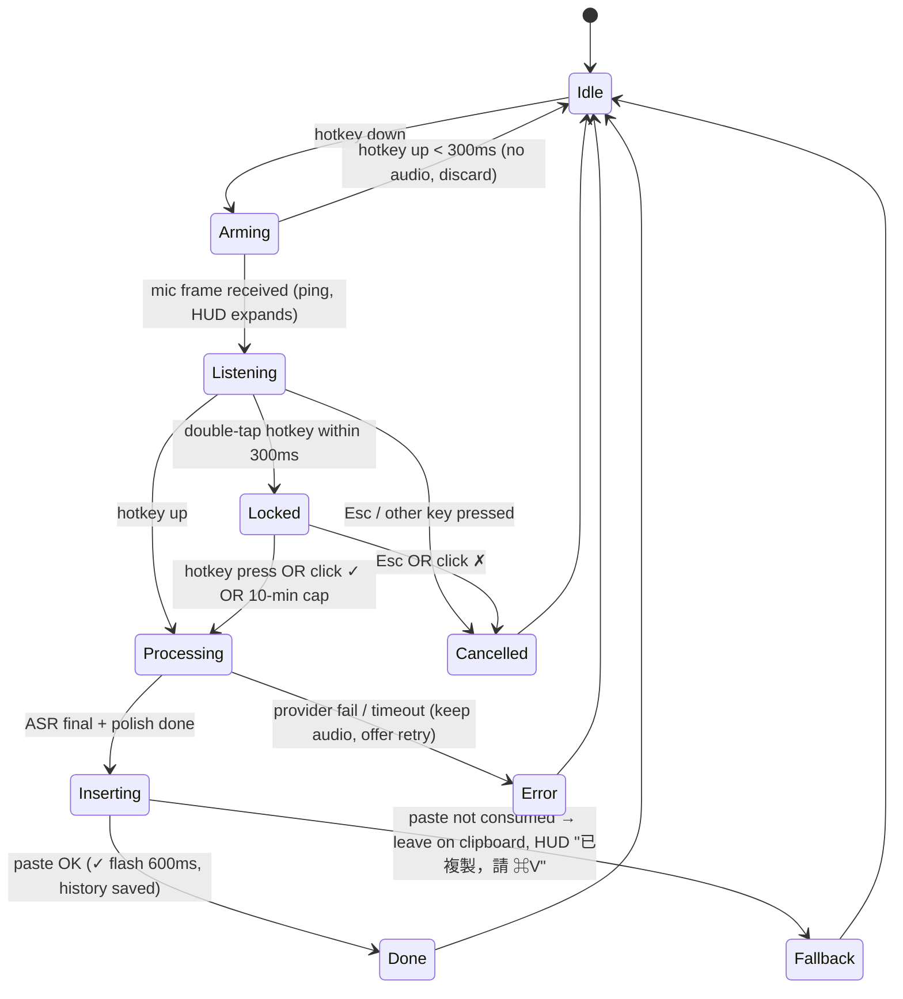

# AI 語音聽寫產品 UX 研究與規格（product-ux）

研究日期：2026-10-01。研究對象：Typeless、Wispr Flow、Superwhisper、Willow、Aqua Voice、Monologue、Apple Dictation，以及 2025–2026 大量出現的開源替代品（OpenLess、OpenTypeless、VoiceInk、Handy、FreeFlow、Whispering、Talky、Speakey 等）。

> **資料來源限制（請先讀）**：本次研究環境的網路出口封鎖了 typeless.com、wisprflow.ai、docs.wisprflow.ai、superwhisper.com、willowvoice.com、withaqua.com、monologue.to、support.apple.com、apps.apple.com、Reddit、HN、Product Hunt 等網域，且 WebSearch 配額已用盡。因此商業產品的 UX 事實主要取自：(1) Apple / Android 官方開發者文件（可直接存取）；(2) GitHub 上的開源專案 README 與原始碼（可直接存取）；(3) GitHub 上第三方對 Typeless / Wispr Flow 等做的「逆向工程 / 競品拆解」研究文件，這些文件本身引用了官方 docs 的 URL。凡屬第 (3) 類的資料，我在內文以 **[二手]** 標示，並附上它所引用的官方 URL，建議在實作前以官方頁面再確認一次。所有價格與限制都可能在 2026 年內變動。

---

## 0. 執行摘要（Executive Summary）

1. **互動模型已經收斂**：市場上所有主流產品（Wispr Flow、Typeless、Superwhisper、Aqua、Willow 與十幾個開源 clone）都採用「按住說話、放開後一次貼上（hold-to-talk + batch insert on release）」為預設，並以「雙擊鎖定 / 專用快捷鍵」提供免持（hands-free / toggle）模式。**沒有任何主流產品把串流中的部分字詞直接寫進目標 App**；串流結果最多只顯示在浮動 HUD 內（Whispering 的 ADR-0016 甚至明文拒絕）。唯一例外是 Aqua Max（$24/月）宣稱「每個字即時處理」，以及中國系產品（OpenLess、Whisper-Input-Next）採「逐字串流寫入游標 + 貼上 fallback」。我們建議預設 batch，進階提供「HUD 預覽」。
2. **預設快捷鍵**：macOS 上 Wispr Flow 與 Typeless 都用 **Fn/Globe 單鍵**（外接鍵盤 fallback 為 Ctrl+Opt）；Windows 上 Wispr Flow 用 **Ctrl+Win**（因 Ctrl 把 Win 鍵「弄髒」，不會彈出開始功能表）。開源品則偏好 Right Option / Right Cmd（Yap、Speakey、DoNotType、Talky）。Fn 在 macOS 需要 CGEventTap + Accessibility/Input Monitoring，而且只在 Apple 內建鍵盤有效；Windows 的 Fn 是韌體層，OS 看不到。
3. **指示器**：三種主流形態：(a) Wispr Flow 的「螢幕底部中央藥丸」（可拖到左右邊停靠、閒置 30×6 px 小點、錄音 330×32 px、5–7 根白色音量條、處理中轉圈、✓/✗ 按鈕）；(b) VoiceInk / OpenTypeless 的「瀏海（notch）或螢幕頂部膠囊」；(c) Superwhisper 的「獨立錄音視窗（Classic / Mini / None）」。皆為非激活（non-activating）浮動面板，不搶焦點。
4. **iOS 鍵盤的硬限制是整個手機端設計的核心**：Apple 文件明載 custom keyboard extension「No access to microphone and speaker」。Wispr Flow 與 Typeless 的 iOS 鍵盤都是「鍵盤只負責 UI 與 insertText，容器 App 負責錄音」，透過 App Group 檔案 + Darwin notification 交換狀態。Wispr 的作法是跳到主 App 錄音再滑回；Typeless 用 Picture-in-Picture / Dynamic Island 讓主 App 在背景持續擁有音訊 session（「Skip app switching」）。而 Apple DTS 已表示沒有公開 API 讓鍵盤啟動容器 App，iOS 26.4 之後私有 API 路徑被封。**這是風險最高的設計決策**。
5. **Android 相對自由**：InputMethodService 可直接 RECORD_AUDIO、連網、`commitText()`；OpenLess 已出貨 Android IME（語音 / 筆畫 / 剪貼簿 / 英文四面板）並以無障礙服務、Shizuku、剪貼簿做跨 App 插入的 fallback 階梯。
6. **中文特殊需求**：Whisper 系模型對台灣華語與中英夾雜表現不佳；MediaTek 的 Breeze-ASR-25（Whisper-large-v2 微調，MIT）在 CSZS zh-en code-switching 測試上 WER 由 29.49% 降到 13.01%。產品層需處理：繁簡輸出選擇（WhisperWoof 的解析順序：聽寫語言 → App UI 語言 → OS locale → 預設）、全形標點、中英之間空格、同音詞靠游標上下文消歧（OpenLess 舉例「接口/借口」）、台語輸出（Speakey 用 SARC-Taigi-LLM）。
7. **功能優先序**：MVP = hold-to-talk + 底部藥丸 + 一次貼上 + 取消 (Esc) + 自訂詞庫 + 繁簡/標點設定 + 權限引導 + 歷史；v1 = hands-free 鎖定、每 App 風格、片語（snippets）、Command Mode（選取文字後語音改寫）、用量統計（字數 / 省下時間）、自動學習詞庫；Later = 螢幕上下文、翻譯模式、團隊詞庫、本地模型管理。

---

## 1. 啟動模型（Activation Models）

### 1.1 各產品預設鍵一覽

| 產品 | macOS 預設 | Windows 預設 | Hold / Toggle | 來源 |
|---|---|---|---|---|
| Wispr Flow | **Fn**（Apple 鍵盤）；無 Fn 時 **Ctrl+Opt** | **Ctrl+Win** | Hold 為主；雙擊快捷鍵或 Fn+Space / Ctrl+Win+Space 進入 hands-free；Command Mode = Fn+Ctrl / Ctrl+Win+Alt；Esc 取消 | [二手] https://github.com/Blueturboguy07/WhimprFlow/blob/HEAD/docs/research/hotkeys-interaction.md（引用 https://docs.wisprflow.ai/articles/2612050838-supported-unsupported-keyboard-hotkey-shortcuts） |
| Typeless | Fn（Apple 鍵盤） | 未確認 | Hold（Whisper-Input-Next 作者抱怨「like Typeless does」需要一直按住） | https://github.com/Mor-Li/Whisper-Input-Next ；https://github.com/yuchenlin/afk/blob/HEAD/docs/PLAN.md（「Fn stays available for Typeless… muscle memory」） |
| Superwhisper | 可設單一修飾鍵（Left Cmd / Right Cmd / Fn 單鍵）；近期預設 ⌥+Space | — | Push-to-talk 與 toggle 皆支援 | [二手] https://github.com/BuilderIO/agent-native/blob/HEAD/templates/clips/desktop/design-refs/wispr-ux.md；https://github.com/thesrivamshi/Speakwell/blob/HEAD/docs/research/COMPETITOR_MATRIX.md |
| Aqua Voice | Hold Space（推測） | — | PTT | [二手] Speakwell COMPETITOR_MATRIX |
| Willow | 未揭露 | — | "Let go. Perfectly formatted text appears"（release-to-send） | [二手] Speakwell COMPETITOR_MATRIX |
| Apple Dictation | 預設「雙擊 🌐/Fn」（外接鍵盤：雙擊 Control） | Win+H（Windows 語音輸入） | Toggle | [二手] WhimprFlow hotkeys-interaction.md；https://github.com/WizisCool/dsh-ears/blob/HEAD/.agent/research/voice-dictation-shortcuts.md |
| FreeFlow (OSS) | Fn hold；Cmd+Fn toggle | — | 兩者皆有 | https://github.com/zachlatta/freeflow |
| OpenTypeless (OSS) | Fn；Fn+Space=Ask；Fn+LeftShift=翻譯 | Right Alt；Linux Ctrl+/ | hold 或 toggle 可選 | https://github.com/tover0314-w/opentypeless |
| Yap / Speakey / DoNotType / Talky (OSS) | Right Option / Right Option / Right Cmd（tap 或 hold）/ 雙擊 Right Cmd | Right Ctrl | DoNotType 提供三種手勢：tap-speak-tap、hold-speak-release、tap-speak-Return | https://github.com/AkuchiS/Yap ；https://github.com/wylopci/speakey ；https://github.com/bojieli/DoNotType ；https://github.com/intentionltd888/talky |
| Handy / SpeakoFlow / Tambourine (OSS) | 可設；SpeakoFlow mac 預設 Option+Space；Tambourine Ctrl+Alt+Space(toggle) / Ctrl+Alt+`(hold) | SpeakoFlow Win 預設 Left Ctrl+Left Super | 兩者 | https://github.com/cjpais/Handy ；https://github.com/AbhishekBarali/SpeakoFlow ；https://github.com/kstonekuan/tambourine-voice |
| whisper-writer (OSS) | ctrl+shift+space | 同 | 四種模式：continuous / voice_activity_detection / press_to_toggle / hold_to_record | https://github.com/savbell/whisper-writer |

### 1.2 為什麼 Fn / Globe？與它的代價

- 理由（[二手] BuilderIO wispr-ux.md）：「Fn is the single key on every modern Mac that has **no built-in OS chord**, no muscle-memory conflict with Cmd-anything, and is easy to hold with the pinky.」
- 代價（[二手] WhimprFlow hotkeys-interaction.md，數值取自 VoiceInk 原始碼）：
  - Fn 的 virtual keycode 是 `kVK_Function = 63`；旗標 `maskSecondaryFn = 0x800000`。
  - 一般 global shortcut 函式庫（Carbon `RegisterEventHotKey`、`tauri-plugin-global-shortcut`、Sindre 的 KeyboardShortcuts）**無法綁定單獨的 Fn**；必須用 `CGEvent.tapCreate` 監聽 `.flagsChanged`（Handy 為此另寫 `handy-keys` crate）。
  - 使用 `.defaultTap` 才能**吞掉** Fn 事件，否則「System Settings → Keyboard → Press 🌐 key to」設成 Emoji / 輸入法切換 / 聽寫時會一起觸發；也要提防與 Apple 內建聽寫的「雙擊 Globe」相撞。
  - 外接非 Apple 鍵盤不會送出 Fn 訊號 → 必須提供 fallback 組合鍵（Wispr 用 Ctrl+Opt）。
  - VoiceInk 的實務參數：Fn debounce 40 ms、shortcut cooldown 500 ms、hold 中斷窗 1.0 s。
  - Secure Input（密碼欄、Terminal 的 Secure Keyboard Entry）會讓 keyDown/keyUp 不送達 event tap；Wispr 的作法是顯示持續通知並點名佔用的 App；因 flagsChanged 仍可達，單鍵 Fn 的 hold-to-talk 能「優雅降級」。
  - Windows 上 Fn 是鍵盤 MCU 內處理、OS 不可見，所以不能當 Windows 預設；而 `RegisterHotKey` 無法綁「純修飾鍵」組合，必須用 `WH_KEYBOARD_LL` hook 自己判斷 down/up（[二手] WhimprFlow win-hotkeys.md，引用 https://learn.microsoft.com/en-us/windows/win32/winmsg/lowlevelkeyboardproc）。
- 開源陣營有人**刻意放棄** bare-Fn / 純修飾鍵（Whispering ADR-0117）以避免「修飾鍵釋放誤重新武裝」等 bug；OpenWhispr 則規定「按住 Fn 期間按任何其他鍵即取消錄音」（https://github.com/ryan-stoffel/hush/blob/HEAD/docs/RESEARCH.md）。Speakey 也採同樣規則：「组合键会中断录音」。

### 1.3 Hands-free / 鎖定的語意（Wispr Flow 為範本）

- Hold 中快速**雙擊**快捷鍵 → 鎖定為 hands-free（雙擊窗推測 250–400 ms；Wispr 內部設定鍵名 `doubleTapWindowMs`，見 [二手] app-teardown.md）。
- 或直接按專用鍵 Fn+Space。
- 結束方式：再按一次快捷鍵、或點藥丸上的 **✓**（確認並貼上）／**✗**（丟棄）。Hands-free 時點擊藥丸本體**不會**停止（避免誤觸）。
- 單次極短 tap → 幾乎沒有音訊 → 空白結果、什麼都不貼（「< 0.5 s 不保存音訊」）。
- 風險：誤雙擊進入鎖定模式，所以 UI 必須在鎖定時明確改變外觀（例如顯示 ✓/✗ 與計時器）。

### 1.4 我們的建議

- macOS 預設 **Fn（hold）**；偵測不到 Apple Fn（`hasAppleFnKey()` via IOHID）則預設 **Right Option**（比 Ctrl+Opt 更接近台灣使用者習慣，且 Yap/Speakey/Talky 等中文 OSS 皆如此）。
- Windows 預設 **Ctrl+Win**（hold），備選 Right Ctrl、Mouse4/Mouse5。
- Linux 預設 Ctrl+/（OpenTypeless 的理由：Wayland 下 Right Alt 全域攔截不可靠）。
- 三態：`hold`（預設）、`toggle`、`hold + 雙擊鎖定`。首次設定時提供「錄製快捷鍵」介面（Raycast 式 Idle → Recording → Captured → Clear），並做衝突偵測。
- 第二快捷鍵：Command Mode（選取文字後語音改寫），第三：Paste last transcript。

---

## 2. 錄音指示器（Recording Indicator）

### 2.1 Wispr Flow「Flow Bar」（[二手] WhimprFlow ui-flow-bar.md + app-teardown.md，引用 docs.wisprflow.ai 的 navigating / hands-free / troubleshooting 文章與 podfeet 評測）

- 位置：**螢幕底部中央**，可拖曳停靠到底 / 左 / 右三個區域（不可停頂部），停靠左右時改為直向；位置持久化；拖曳中按 Esc 取消。
- 視窗：約 440×300 px 透明 overlay，可見藥丸約 70 px；app-teardown 推測的 CSS：靜止 **30×6 px 小點 → 錄音 330×32 px 藥丸 → 展開卡片最多 380×130 px**，morph 動畫 **420 ms**。
- 樣式：深色藥丸（≈`#1a1a1a`）配淡粉文字（≈`#f0d7ff`）、2 px 邊框、圓角 9999 px、Figtree 字體；固定深色、不隨系統主題。
- 狀態：
  - Idle：極小，hover 放大並顯示提示文字「click or hold {shortcut} to start dictating」；hover 露出語言選擇器、Transform 魔杖、▲ 下拉。
  - Listening：**5–7 根白色直條（8–24 px）**隨音量跳動，靜音一段時間後變平；同時播放一聲 ping。
  - Processing：條停住 + 進度 / spinner；文案「Taking longer than usual」、「Flow was processing your last transcript.」（連按時）。
  - Error：「No microphone detected」、「Selected microphone is unavailable」、「Microphone disconnected」（提供「Insert」貼出部分文字）、「Is your microphone muted?」、「We couldn't hear you」、「No internet connection」。
  - Hands-free：顯示 ✓ / ✗。
- 預設**隱藏**（Settings → System → Show Flow Bar 開啟）；右鍵選單：Hide for 1 hour、Settings、Microphone、Languages、Transcript history、Paste last transcript。隱藏時麥克風立即停止。
- 技術：Electron 視窗 `transparent, frame:false, hasShadow:false, focusable:false`、`setAlwaysOnTop(true,'screen-saver')`、`setVisibleOnAllWorkspaces(true,{visibleOnFullScreen:true})`；每 ~400 ms 重新錨定到作用中螢幕的 `visibleFrame`（避開 Dock）。
- 多螢幕 / 全螢幕 App：需錨定正確螢幕的 work area；原生 Spaces 全螢幕可能遮住浮動 UI。

### 2.2 VoiceInk（開源，macOS，可直接讀原始碼）

- 兩種面板：`MiniRecorderPanel.swift` 與 `NotchRecorderPanel.swift`（https://github.com/Beingpax/VoiceInk/tree/main/VoiceInk/Features/Recording/Presentation）。
- Mini：540×430 pt 視窗、作用中螢幕**頂部中央**、距頂 24 pt、`level = .floating`、`collectionBehavior: [.canJoinAllSpaces, .fullScreenAuxiliary]`、`styleMask: [.nonactivatingPanel]`、`hasShadow = false`、可拖曳。
- Notch：以 `safeAreaInsets.top` 取得瀏海高度（預設 180 pt 寬），兩側最多各延伸 240 pt，`level = .statusBar + 3`，不可移動；外接螢幕（無瀏海）退回狀態列厚度。

### 2.3 其他

- Superwhisper：獨立「Recording Window」，可選 **Classic / Mini / None**，含 waveform / status / mode / context 指示；Esc 可關閉（[二手] https://github.com/ognistik/macrowhisper ；https://github.com/sushilk1991/velora/blob/HEAD/docs/research/product-teardown.md，引用 https://superwhisper.com/docs/get-started/interface-rec-window）。
- OpenTypeless：閒置時 36 px 圓形膠囊含 logo，錄音時顯示「錄音點、波形、處理指示、計時器、取消」且不位移；翻譯模式顯示 `JA`/`EN` 語言小標籤；閒置自動隱藏（https://github.com/tover0314-w/opentypeless/blob/HEAD/docs/2026-07-11-typeless-feature-completion-p0-p1-spec.md）。
- OpenLess 的競品觀察：「Typeless/閃電說：Capsule state machine with continuous animations (warming, entry, exit, thinking orb, volume-driven waveform)」（https://github.com/tover0314-w/opentypeless/blob/HEAD/docs/2026-07-08-openless-shandianshuo-typeless-gap-spec.md）。
- Talky（台灣繁中 OSS）：螢幕底部面板顯示即時辨識文字 → 「整理中」→ 「已貼上」後自動消失（https://github.com/intentionltd888/talky）。
- Linux 注意：Handy 在 Linux 預設關閉 overlay，因為某些 compositor 會把它當成 active window、干擾貼上（https://github.com/cjpais/Handy）；SpeakoFlow 在 Wayland 下改跑 XWayland 以維持 overlay 疊層。

### 2.4 建議規格

- 形態：底部中央藥丸（可停靠左右；設定可改為 notch 模式或完全隱藏）。非激活 `NSPanel`（macOS）/ `WS_EX_NOACTIVATE|WS_EX_TOOLWINDOW` 透明視窗（Windows）。
- 狀態機：`idle(6px dot) → arming(ping) → listening(waveform, timer) → processing(spinner, 「處理中」) → inserted(✓ 閃 600 ms) / error(文字 + 動作按鈕)`；hands-free 另有 `locked` 子狀態顯示 ✓/✗。
- 顏色：預設深底白條；錯誤用琥珀色而非紅色（OpenTypeless 的 fallback 狀態用 amber information styling）。
- 音效：開始 ping（可關）；「聽寫時靜音音樂」選項（Wispr：Mac 預設關、Windows 預設開）。

---

## 3. 結果投遞（Result Delivery）

### 3.1 市場現況：batch on release

- Wispr Flow：「does **not** stream partial words into the focused text field… Cleaned, formatted text is inserted **on release** in a single paste」（[二手] BuilderIO wispr-ux.md）；hands-free 也是「your text pastes when you're done」（[二手] WhimprFlow gap-temporal-behavior.md 引用 https://docs.wisprflow.ai/articles/6391241694-use-flow-hands-free）。測得雲端 pipeline 約 **700 ms** end-to-end（[二手] mac-gap-critic.md）。注意：同一研究庫的 oss-clones.md 寫 Wispr「streams word-by-word」，與上述矛盾；以官方 hands-free 文件為準，判定為 batch。
- Superwhisper / VoiceInk / MacWhisper / Handy（預設）皆 batch；Superwhisper 官方理由：「Batch transcription produces more accurate results because the model has full context」。
- Speakwell 的結論：「**Nobody streams partial text into the target application**… Whispering ADR-0016 *Refuse streaming and chunked partial transcription*; ADR-0099 *streaming would only animate a HUD preview*」（https://github.com/thesrivamshi/Speakwell/blob/HEAD/docs/research/COMPETITOR_MATRIX.md）。
- 例外：
  - Aqua Voice Max（$24/月）「Processes every word live」（[二手] Speakwell）。
  - OpenLess：「polished text is written to the cursor **character by character** to reduce perceived latency, with an automatic one-shot-paste fallback」（https://github.com/Open-Less/openless）。
  - Whisper-Input-Next（豆包串流 ASR）：浮動預覽窗模仿輸入法，v3.3.0 改為「deferred insertion」——文字留在預覽直到錄音結束，避免中途打亂游標；暫停時用更高精度模型做句級二次辨識（https://github.com/Mor-Li/Whisper-Input-Next）。
  - SpeakoFlow：設定可選「live during speech」或「insert when stops」。
  - Google AI Edge Eloquent（2026-04，iOS，離線）：App 內顯示即時轉錄，**停頓時**自動去填充詞並潤飾（https://github.com/kishorebr/aivibe-blog/blob/HEAD/content/posts/google-quietly-launched-an-ai-dictation-app-that-works-offline.md，引用 TechCrunch 2026-04-06）。

### 3.2 插入機制與可靠度

- macOS：Wispr 用「剪貼簿貼上 via Swift helper，**不是**逐字鍵入」，並以 `org.nspasteboard.ConcealedType` 標記避免進剪貼簿管理器；用 AX API（`AXUIElement`、`AXSelectedTextRange`）定位；若目標 App 在逾時內未讀取剪貼簿則觸發 `failedPasteNotification`（[二手] app-teardown.md）。hush 的調查：「Every major project defaults to clipboard plus synthetic Cmd+V. None default to AX insertion」，剪貼簿還原延遲 250 ms（VoiceInk）/ 500 ms（Hex、FluidVoice）/ 1.0 s（FreeFlow）。
- 已知坑：
  - macOS 升級後 Accessibility 授權「看起來已信任但靜默丟掉 Cmd+V」→ Whispering 保留 event tap 僅做 liveness check，失敗則把文字留在剪貼簿（hush RESEARCH.md）。
  - 長文貼進終端 AI agent（Claude Code）會塌成 placeholder → VoiceInk 的「Paste in Chunks」250/500/750/1000 bytes（[二手] oss-clones.md 引 VoiceInk #761）。
  - 剪貼簿競態：Handy #502「Pastes clipboard instead of spoken text」。
  - 藍牙麥克風喚醒延遲：macOS 麥克風閒置會斷電，下次啟動要 **2–5 秒**才有樣本；藍牙 SCO 再加 1–3 秒 → 解法是常駐一條靜音 `AVCaptureSession` 保持麥克風暖機（https://github.com/drewburchfield/macos-mic-keepwarm）。
- Windows（[二手] WhimprFlow win-insertion.md）：五段階梯 — UIA `ValuePattern.SetValue`（會取代整欄，Chromium 不觸發 onChange，少用）→ **剪貼簿 + SendInput Ctrl+V（主用）**，設 `ExcludeClipboardContentFromMonitorProcessing` 避免進 Win+V 歷史、終端改 Ctrl+Shift+V、150–400 ms 後還原 → `KEYEVENTF_UNICODE` 逐字鍵入 → 高權限視窗（UIPI）則「已複製，請按 Ctrl+V」。**CJK 輸入法組字中會破壞注入**：以 `ImmGetContext/ImmGetCompositionString` 偵測，組字中改走貼上。注入前要先合成放開 Ctrl/Win 以免變成 Ctrl+Win+V；所有合成事件以 `dwExtraInfo` 標記讓自家 hook 忽略。
- OpenTypeless 提供四種輸出法給使用者選：keyboard simulation / clipboard paste / copy-only / Windows SendInput，並有 clipboard restore；Wayland 無 `wtype` 時降級為「已複製到剪貼簿」並在設定頁顯示狀態文字（https://github.com/tover0314-w/opentypeless/blob/HEAD/docs/2026-08-08-reliability-punctuation-wayland-release-spec.md）。

### 3.3 Ghost text / 預覽

- Wispr、Typeless 均**不**在目標欄位顯示 ghost text。預覽只出現在 HUD（Talky、Whisper-Input-Next、Handy streaming 模式）。
- iOS 鍵盤可用 `UITextDocumentProxy.setMarkedText(_:selectedRange:)` / `unmarkText()` 顯示「組字中」文字（https://developer.apple.com/documentation/uikit/uitextdocumentproxy）；Android IME 可用 `setComposingText()` 再 `commitText()`（https://developer.android.com/develop/ui/views/touch-and-input/creating-input-method）。這是行動端可做「原生 ghost text」的正統途徑，桌面端沒有等價 API。

### 3.4 建議

- 預設：放開後一次貼上（目標 < 1 s 感知延遲；開始錄音時就建立 ASR session、放開時只送最後一幀，如 OpenLess 的 `hotkey edge → Recorder.start + ASR.openSession → … → Polish → Insert → History.save`）。
- HUD 內顯示串流 partial（讓使用者知道「有在聽」），不寫入目標 App。
- 行動端用 composing text 做 ghost text。
- 插入階梯 + 失敗偵測 + 「Paste last transcript」快捷鍵 + 歷史重貼。

---

## 4. 停頓、長時間聽寫、取消與復原

- **Session 上限**：Wispr Flow 桌面 **20 分鐘**（19 分鐘警告「You have less than 1 minute left…」，到時自動停止、轉錄、貼上，並提供「Recover text」按鈕）；iOS 5 分鐘無預警；Android 5 分鐘前 1 分鐘 toast + 震動（https://github.com/vkorost/wispr-flow-field-guide/blob/HEAD/book/chapters/02-the-dictation-model.md，引 https://docs.wisprflow.ai/articles/4841123325-longer-dictation-sessions-now-up-to-20-minutes）。Typeless 免費版「~6 分鐘 / session」（[二手] https://github.com/Terobyte/OpenVerb/blob/HEAD/docs/architecture/10-typeless-competitive-reference.md）。OpenTypeless 雲端 10 分鐘，文案「还有 10 秒达到本次录音上限，已录内容会正常转写」、「本次已录满 10 分钟，正在转写。已录内容不会丢失」。
- **停頓**：hold 模式天然不受停頓影響。Hands-free 模式若用 VAD 自動結束，需容忍 **3–20 秒**思考停頓，否則「treating >2 s of silence as done」會把一句話切碎；Whisper 對靜音會幻覺（「Thank you for watching」），要前置 VAD gating、`no_speech_threshold ≥ 0.6`、`condition_on_previous_text=False`，或改用 Parakeet 類不會在靜音產字的模型（https://github.com/danielrosehill/Live-Typing-UX-Research/blob/HEAD/ideas/pause-tolerant-dictation-profile-and-stack.md）。OpenLess 另有「silent auto-stop」。
- **連續 session**：Wispr「no cooldown between sessions」，上一段處理中按鍵即可開下一段，HUD 顯示「Flow was processing your last transcript」。
- **取消**：Esc 在任何階段取消（Wispr、OpenLess）；按住期間按其他鍵取消（OpenWhispr、Speakey）；hands-free 的 ✗。
- **復原**：Wispr「Undo AI edit」永遠可回到原始 ASR 文字（hard product invariant）；Fn+D「View Diff」看清理前後差異。歷史頁可重貼、重潤飾（OpenLess：re-polish、re-insert）。
- **自我更正**：Wispr 的 Backtrack 關鍵詞「actually / scratch that / wait / no / I mean」只保留更正後版本；「I actually enjoyed the movie」中的 actually 不觸發（[二手] edit-behavior.md 引 https://docs.wisprflow.ai/articles/5373093536-how-do-i-use-smart-formatting-and-backtrack）。Talky 的中文版：「啊不對，是……」只輸出更正後內容。

---

## 5. 錯誤狀態（Error States）

| 狀態 | 業界作法 | 建議 |
|---|---|---|
| 無麥克風權限 | Onboarding 卡片直接開 System Settings；Wispr HUD「No microphone detected」 | 首次啟動必經；設定頁常駐狀態列，紅/琥珀燈 + 「開啟系統設定」按鈕 |
| 無 Accessibility（macOS） | Wispr：mic + accessibility 兩張權限卡；Talky：「需要輔助使用權限才能偵測 Command 鍵與貼上」 | 貼上失敗時彈「文字已複製，請手動 ⌘V」+ 一鍵前往授權；偵測「授權失效」(升級後) 做 liveness check |
| Input Monitoring（macOS，Fn 偵測） | 需 Input Monitoring 或 Accessibility（.defaultTap） | 兩者都要求，但順序：先 mic → 再 accessibility → Fn 偵測失敗才要 input monitoring |
| Secure Input | Wispr 持續通知並點名佔用 App | 同；hold-to-talk 走 flagsChanged 仍可用 |
| 離線 | Wispr「No internet connection」（純雲端） | 有本地模型時自動 fallback 到本地 + HUD 標示「離線模式」 |
| 麥克風音量過低 | Speakey「低音量觸發通知提示」；Wispr「We couldn't hear you」 | HUD 顯示「聽不到聲音，請檢查麥克風」 |
| Provider 失敗 / session 過期 | OpenTypeless「Session expired. Sign in again」並保留 BYOK 設定；OpenLess「错误可读与重查」 | 錯誤要可讀、可重試、不丟音訊（保留 audio 可重轉） |
| 目標欄位不可寫 | OpenWhispr：改在浮動面板串流顯示；OpenTypeless：複製到剪貼簿 | 同 |

---

## 6. Onboarding

Wispr Flow 的順序（[二手] BuilderIO wispr-ux.md）：登入 → 麥克風 + Accessibility 權限卡 → 麥克風測試（同款白色音量條）→ 快捷鍵設定 → 語言選擇 → **「Try It Yourself」沙盒**（模擬 Gmail / Notion 讓使用者練習）→ 進入 Flow Hub。

VoiceInk 的 onboarding 畫面（原始碼檔名，https://github.com/Beingpax/VoiceInk/tree/main/VoiceInk/Features/Onboarding/Views）：Trust → Permissions → Microphone → Model（下載本地模型）→ API → ContextAwareness → Experience → License。

VoxInk Android 計畫：6 步不可跳過：歡迎 → API key → 系統啟用鍵盤 → 麥克風權限 → 練習錄音 → 完成（https://github.com/soanseng/voxpen-android/blob/HEAD/plan.md）。

OSGKeyboard（iOS）：首次用 App Attest 匿名憑證讓使用者**不登入先試**語音；鍵盤內的多步引導遮罩後來被移除，改為只在主 App 完成（https://github.com/hkgood/OSGKeyboard）。

**建議流程（桌面）**：
1. 歡迎 + 隱私說明（本地 vs 雲端一句話）。
2. 麥克風權限 → 即時音量條確認。
3. Accessibility（macOS）/ 無（Windows）。
4. 選快捷鍵（預設 Fn；外接鍵盤自動改 Right Option）+ 即時「按住試試」。
5. 語言：預設「中文（繁體）+ English 自動切換」，可改。
6. 練習句（含中英夾雜）：「幫我把這份 PRD 的 API 設計 review 一下，明天 standup 討論」→ 顯示清理前後 diff。
7. 詞庫種子：匯入通訊錄 / 常用詞（選填）。
8. 完成，顯示 HUD 在哪、Esc 取消、歷史在哪。

**手機**：主 App 內完成「啟用鍵盤 → 允許完整取用（解釋為什麼）→ 麥克風 → 試打」；iOS 需額外教「切回原 App」手勢（見第 10 節）。

---

## 7. 設定面（Settings Surface）

### 7.1 業界設定項盤點

- Wispr Flow（[二手] feature-inventory.md / ui-flow-bar.md）：語言（自動偵測 99+ 或手選 2–3 種以提升準確度，官方建議手選；一個 session 只鎖一種語言）、個人化（自動學習詞庫、片語）、風格（4 類 App：Personal / Work / Email / Other × 語氣 Formal / Casual / Very Casual / Excited；只改大小寫、標點、空格，不改語法）、Auto Cleanup 4 級、快捷鍵、Flow Bar 顯示、Mute music、資料與隱私（never store / 24h 自動刪除）、Polish / Transforms（9 槽）。
- Typeless（[二手] OpenTypeless roadmap spec）：Personal dictionary、Different tones for each app、Personalized style and tone、Ask Anything、翻譯、100+ 語言、Whisper Mode（AGC）。
- Superwhisper：Modes（Voice to Text 無 AI / Message / Email / Note / Super / Meeting / Custom）、按 App / 網站自動切換模式、Recording Window 樣式、paste / simulate keypress / clipboard restore、模型選擇。
- OpenTypeless：標點三模式 **Automatic / Command only / Disabled**；錄音上限；文字輸出方式；每 App 風格（10 個語意家族：Email、WorkChat、PersonalChat、Document、ProjectManagement、DeveloperCollaboration、PromptOrCode、Support、Social、General）；AI Polish「Adapt writing to current app」開關與「Last dictation context」唯讀列。
- OpenLess：四種輸出模式 raw / light polish / structured / formal；Style packs（自訂 system prompt，可用快捷鍵切換）；Cursor context（macOS opt-in，讀游標周邊文字做同音詞消歧）；Learn from corrections（確認後自動入詞庫）；UI 語言 简中 / 繁中 / English / 日 / 韓。
- Speakey（中文）：精簡程度「輕（只去語助詞）→ 強（重點摘要）」語意級滑桿；台語輸出（SARC-Taigi-LLM）；自動建議常用詞；偵測重複誤辨並提議永久修正規則。
- Whisper-Input-Next：`CONVERT_TO_SIMPLIFIED`、`ADD_SYMBOL`、`OPTIMIZE_RESULT` 開關。
- WhisperWoof：繁簡解析順序「聽寫語言 → App UI 語言 → OS locale → 預設簡體」，用 opencc 做 t2cn；auto 不可一律落到簡體（https://github.com/h3qing/WhisperWoof/blob/HEAD/CHANGELOG.md）。

### 7.2 設定 Schema（建議）

```yaml
# settings.schema.yaml  (v0.1)
general:
  ui_language: zh-TW | zh-CN | en | ja        # 預設跟 OS
  launch_at_login: bool
  show_menu_bar_icon: bool
hotkeys:
  dictate:        { keys: "fn", mode: hold | toggle | hold_with_double_tap_lock }
  dictate_fallback_no_apple_fn: { keys: "right_option" }
  command_mode:   { keys: "fn+ctrl" }
  paste_last:     { keys: "fn+v" }
  cancel:         { keys: "escape" }
  double_tap_window_ms: 300
  fn_debounce_ms: 40
indicator:
  style: pill_bottom | notch | mini_top | none
  dock: bottom | left | right
  show_when_idle: bool            # Wispr 預設 false
  start_sound: bool
  mute_media_while_dictating: bool  # mac false / win true
  show_live_preview_in_hud: bool
delivery:
  insert_method: auto | paste | type | copy_only   # auto = 階梯
  restore_clipboard: bool
  clipboard_restore_delay_ms: 300
  chunk_paste_bytes: 0 | 250 | 500 | 1000
  terminal_paste_shortcut: ctrl_shift_v
language:
  mode: auto | fixed
  candidates: [zh-TW, en]          # auto 時只在候選間切換（Wispr 建議 2–3 種）
  chinese_script: traditional | simplified | follow_dictation_language
  taiwan_mandarin_hint: true       # 送給 ASR 的 prompt / contextual strings
  code_switch: keep_english_terms  # 中英夾雜：英文術語保留原文
text_formatting:
  punctuation: auto | spoken_only | off
  chinese_punctuation: fullwidth | halfwidth
  space_between_cjk_and_latin: bool   # 「盤古之白」
  trailing_period_in_chat_apps: strip | keep
  auto_capitalize: bool
  numbered_list_from_enumeration: bool
  filler_removal_level: 0 | 1 | 2 | 3    # 0=原文, 1=去嗯啊, 2=去重複/自我更正, 3=重寫精簡
  self_correction_backtrack: bool
dictionary:
  entries: [{ term, pronunciation_hint?, aliases:[misheard...], starred: bool, source: manual|learned }]
  auto_learn_from_corrections: bool
  import_csv: path
snippets:
  entries: [{ trigger (<=60 chars), expansion (<=4000 chars) }]
styles:
  adapt_to_app: bool
  per_app: [{ bundle_id|exe|url_pattern, family: email|work_chat|personal_chat|document|code|social|general, tone: formal|casual|very_casual|excited, custom_prompt? }]
  default_tone: casual
command_mode:
  enabled: bool
  max_selection_words: 1000
  ask_panel_position: near_cursor | center_top
session:
  max_minutes: 10            # 警告在 max-1
  silence_auto_stop_s: 0 | 20 | 60   # hands-free 用；0 = 不自動停
  keep_mic_warm: bool        # 解 2–5 s 藍牙延遲
history:
  retention: never | 24h | 30d | forever
  keep_audio_days: 0 | 14
  local_only: true
stats:
  enabled: bool
  typing_baseline_wpm: 60 (en) / 30 (zh 字/分)
privacy:
  context_awareness: off | accessibility_text | screenshot
  exclude_password_fields: true (固定)
  cloud_provider: none | ours | byok
```

---

## 8. Command Mode / 語音編輯

- Wispr Flow：按住 Fn+Ctrl（Win: Ctrl+Win+Alt），**選取文字 + 說指令** → 原地替換；無選取則內聯生成；上限 1,000 字；Pro 限定、桌面限定；指令如「Make this more concise」「Translate to Polish」；2026-05 新增具名 Transforms（Polish、Prompt Engineer，可自訂）。在一般聽寫中內嵌指令需以「Hey Flow」開頭；沒有選取也沒有上下文時「nothing happens, and failed edits show no error」（這是 UX 缺口）。（[二手] edit-behavior.md、hush RESEARCH.md；引 https://docs.wisprflow.ai/articles/4816967992-how-to-use-command-mode）
- Typeless「Ask Anything / Voice Superpowers」：選取文字後按快捷鍵說「改寫成專業 email / 摘要 / 解釋 / 翻譯 / 搜尋」，答案出現在彈出面板，草稿則直接放進欄位（[二手] OpenTypeless roadmap / gap spec）。
- FreeFlow：Edit Mode「make this shorter」「turn this into bullets」。
- SpeakoFlow：以「Hey Flow」前綴觸發 AI 生成。
- OpenLess：Selection 流程「選區編輯與空選區起草 → 意圖 → 預覽 → 應用 / 取消 / 撤回」；OpenTypeless 路由：`DictateInsert`（預設）/ `DraftInsert`（以允許清單的指令前綴開頭）/ `RewriteSelection` / `Ask`（非破壞性彈窗），並指出風險：「使用者選了文字講話，期待替換卻得到答案面板」→ 破壞性動作需預覽或確認。
- OpenTypeless「Ask Anything 浮動便條」規格：寬 380 px（360–420）、高 160–420 px 自適應、置中偏上、圓角 8–12 px、五態 `idle → recording → thinking → result/error → dismissed`、Esc 或點外部關閉、關閉後遲到的結果**不得**再彈出（https://github.com/tover0314-w/opentypeless/blob/HEAD/docs/2026-07-07-ask-anything-floating-note-ux-spec.md）。

**建議**：第二快捷鍵進入 Command Mode；有選取 → 顯示「將替換 N 字」的預覽卡（可 Esc）；無選取 → 答案面板；中文觸發詞「刪掉那句」「改正式一點」「翻成英文」走允許清單前綴，避免誤判。

---

## 9. 歷史、統計與成長功能

- Wispr Flow Home：依日分組的轉錄（含 Polish / transform 歷史與音訊）、個別 / 批次刪除、「never store / 24 h 自動刪」、音訊桌面保留 14 天；**Usage tab**：總字數 + 月徽章、WPM 儀表（與全球打字速度百分位比較）、更正次數、連續使用熱圖、App 類別分布、「time saved」（以 60 WPM 打字基準計算）（[二手] feature-inventory.md）。
- Typeless：行銷「~220 wpm voice vs 45 wpm typing」；VoxInk 計畫明寫「Display stats in settings (like Typeless does)：You've saved X hours this month」。
- Google AI Edge Eloquent 也追蹤 WPM 與總字數。
- Superwhisper：`~/superwhisper/recordings` 資料夾 + meta.json，可被第三方（macrowhisper）監看做自動化。
- OpenLess：歷史「列表 / 詳情切換（窄窗）」、重潤飾結果保留、搜尋、re-insert；OpenTypeless 歷史列：`[logo] Context label · time · provider`。

**建議**：歷史本地 SQLite（可加密），每筆存 raw ASR、polished、app、mode、音訊（可選）；統計頁：字數、估算省下時間（中文以 30–40 字/分打字基準，英文 40–60 WPM）、連續天數；提供「分享成就卡」（成長功能）但預設不上傳。

---

## 10. 多語言自動切換與中文特殊議題

### 10.1 自動切換
- Wispr：100+ 語言含 Simplified / Traditional Chinese 與 Cantonese；自動偵測「一個 session 一種語言，句中切換會鎖定語言」；Flow Bar 語言選擇器一鍵切換（2026-03）。
- OpenTypeless：翻譯模式顯示語言小標籤並可「in-flow target switching」。
- Speakey：中 / 英 / 日 / 韓自動偵測免手動。
- Breeze-ASR-25：針對「台灣華語 + 中英 code-switching（句內與句間）」微調，MIT 授權（https://github.com/mtkresearch/Breeze-ASR-25）。
- Apple `DictationTranscriber`（iOS/macOS 26+）使用與系統聽寫相同的離線模型，支援 `contextualStrings` 偏置，鎖定 locale 清單含 zh-CN（頁面未列 zh-TW，需驗證）（https://developer.apple.com/documentation/speech/dictationtranscriber）。`SpeechTranscriber` 以 `volatileRange` / `finalize(through:)` 提供 partial / final 結果（https://developer.apple.com/documentation/speech/speechanalyzer）。
- FluidAudio（CoreML Parakeet v3）**不支援中文**，中文要走 SenseVoice / Paraformer（https://github.com/FluidInference/FluidAudio）。

### 10.2 中文 UX 需求清單
1. **繁簡輸出**：明確設定，auto 時依「聽寫語言 → UI 語言 → OS locale」解析，不可預設簡體（WhisperWoof 的 bug 教訓）。Talky：whisper 輸出後再「繁體化」。
2. **全形標點**：中文句子用「，。？！」；英文片段內用半形；提供 Automatic / 口述標點 / 關閉三模式（OpenTypeless 的中文口述標點表：句号、逗号、问号、感叹号、冒号、分号、换行、新段落、左引号、右引号 → 我們需繁體版：句號、逗號……）。
3. **中英夾雜**：英文術語保留原文大小寫（API、Kubernetes、PR）；中英之間是否加空格（盤古之白）做成開關；向 ASR 送 prompt hint「繁體中文，可能夾雜英文」（VoxInk 作法）並省略 `language` 參數。
4. **同音詞 / 專有名詞**：游標周邊上下文消歧（OpenLess 例：接口/借口、大鱼/大禹）；個人詞庫支援「正確寫法 + 常見誤辨（aliases）」而非只有正確字（WhimprFlow 的洞見：注入 `{wrong→correct}` 映射比只給正確拼法有效）；中文詞庫比對用子字串而非 word boundary（VoiceInk 對 CJK 的處理）。
5. **注音使用者的期待**：注音使用者習慣「選字」；語音輸入沒有候選列會讓錯字無法即時修正 → HUD 預覽 + 歷史「一鍵改字並學習」是替代方案；行動端可用 composing text 讓錯字段落可被系統選字列接手（待驗證）。
6. **口語 → 書面**：Talky 的「口語轉正式書面台灣華語」；Speakey 的語助詞「嗯、啊、那個」清除；閃電說強調中文對話的「結構化整理」。
7. **台語**：Speakey 以 SARC-Taigi-LLM 將潤飾後華語轉台文——Later 階段可考慮。
8. **口述指令中文化**：「換行」「新段落」「刪掉那句」「送出」（對應 Wispr 的 press enter）。

---

## 11. 無障礙（Accessibility）

- Wispr Flow 鍵盤 / 螢幕閱讀器文章：互動元件宣告 expanded / collapsed / disabled，Tab 有焦點環，Space / Enter 啟用，Esc 關閉；缺點：拖曳停靠區只有視覺提示（[二手] ui-flow-bar.md）。
- 建議：HUD 所有狀態變化同步 VoiceOver / NVDA 公告（「開始錄音」「已貼上 42 字」）；提供純音效 / 震動回饋模式（Handy 在 Linux 關 overlay 時改用 audio feedback）；提供高對比 / 減少動態（reduce motion）選項；快捷鍵可全部重綁且支援滑鼠側鍵（Wispr 允許 Middle / Mouse4–10）。

---

## 12. 行動端鍵盤 UX

### 12.1 iOS：硬限制與兩種解法

- Apple 官方：沒有 Full Access 時「No access to microphone and speaker」、唯讀共享容器；Full Access 給網路、共享容器、Contacts / Location；使用者必須在 Settings 打開「Allow Full Access」並會看到警告（https://developer.apple.com/documentation/uikit/configuring-open-access-for-a-custom-keyboard）。鍵盤需實作 Next Keyboard（`needsInputModeSwitchKey`）、受獨立記憶體上限、以 `textDocumentProxy.insertText` 插字（https://developer.apple.com/documentation/uikit/creating-a-custom-keyboard）；`hasDictationKey`、`hasFullAccess`、`advanceToNextInputMode()`、`dismissKeyboard()`（https://developer.apple.com/documentation/uikit/uiinputviewcontroller）。
- 多個獨立研究一致指出：**即使 Full Access 也不能錄音**（`AVAudioEngine` 啟動會回 CoreAudio 錯誤）；「Every dictation keyboard on the App Store — Wispr Flow, Typeless, Superwhisper — works around this the same way: the keyboard bounces to its container app, the app records, and the transcript is handed back」（https://github.com/csbenson001/saleshunter-coach/blob/HEAD/docs/design/ios-voice-keyboard.md；https://github.com/OxFrancesco/BuddyGrammar/blob/HEAD/docs/research/wispr-typeless-ios-voice-keyboard-architecture.md；https://github.com/yuchenlin/afk/blob/HEAD/ios/README.md）。
- **Wispr Flow iOS 流程**（[二手] BuddyGrammar 研究，引 https://docs.wisprflow.ai/articles/7453988911-set-up-the-flow-keyboard-on-iphone）：鍵盤點麥克風 → 開啟 Flow 主 App → iOS 26.4+ 使用者需**手動滑回**原 App → Flow 在背景錄音（Dynamic Island 計時器 + Live Activity）→ 雲端轉錄 → App Group 回傳 → 鍵盤 `insertText`。v1.63+ 對 Claude / ChatGPT / Gemini / Grok / LinkedIn / 訊息類 App 有「native switchback」（特定 deep link）。免費 iOS 1,000 字/週、session 5 分鐘。
- **Typeless iOS 流程**（[二手] 同上，引 https://www.typeless.com/help/release-notes/ios/picture-in-picture）：設定「Skip app switching」→ Picture in Picture 模式（把 PiP 視窗拖到螢幕邊緣，主 App 以 AVKit 背景模式持續持有音訊 session，「麥克風只在說話時開」）或 Dynamic Island 模式（Always / 12 小時 / 5 分鐘）。機制未公開；Apple 文件說 Live Activity 本身不能維持程序存活。
- **風險**：BuddyGrammar 的 Apple DTS 往來：鍵盤啟動其他 App 違反 Review Guideline 4.4.1（只能開 Settings），PiP 當 keepalive 可能牴觸 2.5.4；iOS 26.4 封了私有 `LSApplicationWorkspace` 回跳；iOS 27 的 `allowedExecutionTargets = .main` 可能是正道但待驗證（https://github.com/OxFrancesco/BuddyGrammar/blob/HEAD/docs/research/apple-keyboard-workarounds.md）。
- **替代入口**：`AudioRecordingIntent`（iOS 18+）可從 Action Button / Control Center / Lock Screen 啟動錄音而不離開目前 App，再經 App Group 插字（saleshunter-coach 設計）。
- **鍵盤版面**（saleshunter-coach 與 VoxInk 設計）：Voice 模式 = 頂部狀態列 + 中央大麥克風藥丸（閒置漸層、錄音紅）+ 兩側 backspace / @ + 底部 globe、空白鍵、寬 return；EN 模式 = 完整 QWERTY 做 fallback；左右滑切模式。無 Full Access 時只開 EN 模式並在語音面板說明原因。記憶體：鍵盤程序不載模型、不存音訊。
- **使用者行為**：中文部落格估「70–80% 用户根本不开 Full Access」（https://github.com/Adamlixi/adamLee/blob/HEAD/_posts/2025-05-13-AI-Input-Method.md，非量化來源）；Willow 被記錄「iOS keyboard UX friction; accidental sends in Messages」。

### 12.2 Android

- `InputMethodService` 可直接 `RECORD_AUDIO`、連網；`commitText()` / `setComposingText()`；`switchToNextInputMethod(false)` / `switchToPreviousInputMethod()` 切回原鍵盤（https://developer.android.com/develop/ui/views/touch-and-input/creating-input-method；https://developer.android.com/reference/android/inputmethodservice/InputMethodService）。
- OpenLess Android IME：四個面板（语音、笔画、剪贴板、英文），狀態「待机、录音、思考」，結果 `commitText()` 寫入游標；跨 App 插入 fallback「无障碍、Shizuku 或剪贴板回退」；OEM（小米等）後台限制需實機回歸（https://github.com/Open-Less/openless/blob/beta/docs/android-ime.md）。
- 中國 ROM 的自啟動白名單讓預裝輸入法占優（adamLee 文）。
- 無障礙服務可用 `AccessibilityNodeInfo.ACTION_SET_TEXT` / `ACTION_PASTE` 寫入其他 App 的欄位（https://developer.android.com/reference/android/view/accessibility/AccessibilityNodeInfo）——但 Google Play 對 AccessibilityService 用途審核嚴格（此點來自既有知識，未能存取政策頁驗證）。
- Wispr Android：5 分鐘 session、前 1 分鐘 toast + 震動。

### 12.3 建議

- **Android 先行**（技術風險低）：語音優先 IME（大麥克風 + 切回鍵 + 刪除 + 換行 + 送出）+ 可切到迷你 QWERTY；不做無障礙注入（Play 審核風險），只在 IME 內 `commitText`。
- **iOS**：v0 先做「主 App 內聽寫 + 分享 / 複製」與 `AudioRecordingIntent`（Action Button）；v1 做鍵盤擴充（Full Access + App Group 檔案 + Darwin notification + 容器 App 背景音訊模式），採「可見交接」路線（Wispr 式），**不**用 PiP keepalive 或私有 API。鍵盤內需有 EN fallback 鍵盤以降低切換成本。

---

## 13. 流程圖

### 13.1 桌面：Hold-to-talk 主流程



### 13.2 桌面：插入階梯

```mermaid
flowchart TD
    A[polished text] --> B{secure input / password field?}
    B -- yes --> Z[copy only + notify]
    B -- no --> C{IME composing? (Win: ImmGetCompositionString)}
    C -- yes --> D[clipboard + Ctrl/Cmd+V]
    C -- no --> E{insert_method}
    E -- auto/paste --> D
    E -- type --> F[Unicode typing (SendInput / CGEvent)]
    D --> G{target consumed clipboard within 400ms?}
    G -- yes --> H[restore clipboard, done]
    G -- no --> F
    F --> I{success?}
    I -- yes --> H
    I -- no --> Z
```

### 13.3 iOS 鍵盤 ↔ 容器 App 交接

```mermaid
sequenceDiagram
    participant K as Keyboard ext (no mic)
    participant G as App Group (up.json / down.json)
    participant A as Container app (mic + background audio)
    K->>G: write up.json {session, hostBundleID, start}
    K->>A: open app (visible handoff) / or user uses Action Button intent
    A->>A: AVAudioSession.record, stream to ASR, polish
    A->>G: write down.json {committed, partial, state}; Darwin notify
    Note over K,A: user swipes back to host app (iOS 26.4+: manual)
    G-->>K: Darwin notify → re-read down.json
    K->>K: setMarkedText(partial) as ghost; insertText(committed past high-water mark)
    K->>G: write {stopRequested}
    A->>G: state=complete
```

### 13.4 Command Mode

```mermaid
flowchart LR
    S[Fn+Ctrl held] --> T{selection exists?}
    T -- yes --> U[record instruction] --> V[LLM rewrite selection] --> W[preview card: 將替換 N 字 / Enter 套用 / Esc 取消]
    T -- no --> X[record question] --> Y{intent}
    Y -- draft --> Z1[insert at cursor]
    Y -- ask/explain --> Z2[floating answer panel (380px), Copy, Esc]
```

---

## 14. 功能優先清單

### MVP（4–6 週可驗證）
1. macOS + Windows 桌面：hold-to-talk（Fn / Ctrl+Win）、toggle 選項、Esc 取消。
2. 底部藥丸 HUD（idle 點 / 波形 / 處理中 / 錯誤文案），非激活、全 Space 可見。
3. 一次貼上 + 剪貼簿還原 + 失敗 fallback「已複製」。
4. 語言：繁中 + 英文自動切換；繁簡輸出選項；全形標點；中英空格開關；填充詞移除 2 級。
5. 個人詞庫（詞 + 誤辨別名）、CSV 匯入。
6. 本地歷史（raw / polished、重貼、刪除）。
7. Onboarding：權限 → 快捷鍵 → 練習句（中英夾雜）。
8. 錯誤狀態：麥克風 / Accessibility / 離線 / Secure Input。

### v1
9. Hands-free 鎖定（雙擊）+ 10 分鐘上限與 9 分鐘警告 + 靜音自動停。
10. 每 App 風格（email / chat / document / code）+ 聊天 App 去句尾句點。
11. 片語（snippets，語音觸發）。
12. Command Mode（選取改寫 + Ask 面板，含預覽確認）。
13. 自動學習詞庫（從使用者修改 diff 學，只收專有名詞，✨ 標記、可移除）。
14. 統計頁（字數、省下時間、連續天數）。
15. Android IME。
16. 口述指令中文化（換行、新段落、送出、刪掉那句）。
17. Paste last transcript 快捷鍵；麥克風暖機。

### Later
18. iOS 鍵盤擴充（App Group 交接）+ Action Button intent。
19. 游標上下文 / 螢幕上下文（opt-in）做同音詞與人名消歧。
20. 翻譯模式（說中文出英文）。
21. 本地模型管理（Breeze-ASR-25 / SenseVoice / Apple SpeechAnalyzer）、離線模式。
22. 團隊詞庫、跨裝置同步（加密）。
23. 台語輸出、Whisper（氣音）模式。
24. Linux（Wayland `wtype` 偵測與降級文案）。

---

## 15. 對我們的設計意涵

1. **不要發明新互動**：hold-to-talk + batch insert 是使用者已被 Wispr / Typeless 訓練好的肌肉記憶；創新放在中文品質與可靠度，而非改動基本手勢。
2. **可靠插入比花俏 HUD 重要**：OSS 社群的 issue 幾乎都集中在貼上失敗（剪貼簿競態、終端、Electron、Wayland、授權失效）。要有「插入階梯 + 失敗偵測 + 永遠能從歷史重貼」。
3. **Fn 綁定要自己寫事件層**：不能依賴 Tauri / Electron 的 global shortcut；macOS 用 CGEventTap `.defaultTap`，Windows 用 `WH_KEYBOARD_LL`；都要有 stale-key watchdog。
4. **中文是差異化**：繁簡解析、全形標點、中英空格、同音詞上下文、詞庫 aliases、口語→書面 —— 這些 Wispr / Typeless 做得一般，台灣 OSS（Talky、Speakey）已證明需求存在。
5. **iOS 是最大風險**：鍵盤無法錄音是 Apple 硬限制；Typeless 的 PiP 招數有審核風險，Wispr 的可見交接有摩擦。先把 Android 與桌面做好，iOS 走保守路線並密切追蹤 iOS 27 `allowedExecutionTargets`。
6. **統計與成長**：字數 / 省下時間 / 連續天數是 Wispr 與 Typeless 都在用的留存機制，成本低，v1 就做。
7. **隱私敘事二選一**：架構式（本地、可驗證）或契約式（雲端 + SOC2）。中文 ASR 要好多半得用雲端（Breeze 可本地但大），建議「雲端預設 + 本地可選 + 歷史本地」。
8. **定價錨點**：Wispr Pro $15/月（年付 $12）、免費 2,000 字/週；Typeless 免費 8,000 字/週、Pro $12/月年付；Superwhisper $8.49/月或 $249.99 終身；Aqua Pro $8/月；Willow $12/月。市場清算價 $8–12/月；台灣市場可考慮以「字數 / 週」為免費門檻的同款 UX。

---

## 16. 未解問題

1. Typeless 的確切預設快捷鍵、HUD 尺寸與 Windows 預設鍵——官方站被封鎖，只有二手來源（Fn、hold-to-talk、免費 8,000 字/週、~6 分鐘 session、Pro $12/月年付或 $30/月月付）。
2. Wispr Flow hands-free 到底是純 batch 還是分段處理？兩份研究互相矛盾；官方文件偏 batch，需實機確認。
3. Wispr 免費額度「2,000 字/週」（多數來源）vs「2,000 字/月」（一篇引用 TechCrunch 的文章）——以官方 pricing 為準。
4. Aqua 免費額度「1,000 字終身」vs「1,000 字/月」；Superwhisper「$8.49/月」vs「$9.99/月」——需查官方頁。
5. Monologue、Willow 的實際啟動鍵與 HUD 形態未能取得第一手描述。
6. Typeless Dynamic Island 模式如何讓主 App 在背景持續 12 小時擁有麥克風——未公開，且可能違反審核指南；iOS 27 `allowedExecutionTargets` 是否能合法解決。
7. Apple `DictationTranscriber` 的鎖定 locale 清單只列 zh-CN；zh-TW 是否可用需在 iOS/macOS 26 實機驗證。
8. Breeze-ASR-25 的中文訓練資料全為合成（ODC Synth 10,000 小時），真實台灣口音與噪音環境下的表現需自建測試集。
9. iOS 鍵盤內用 `setMarkedText` 做 ghost text 是否能與系統注音候選列相容、在微信 / LINE 等 App 的行為是否一致——需實測。
10. Android 上若不做無障礙注入，只做 IME，使用者切換鍵盤的摩擦（globe 長按）是否可接受；Gboard 式「語音 IME 用完自動切回」的 `switchToPreviousInputMethod()` 在各 OEM 上的穩定度。
11. 中文「省下時間」的打字基準（字/分）沒有公認數字，需定義並說明。
12. Google AI Edge Eloquent（Gemma ASR 離線、免費）若推出 Android / 鍵盤整合，會改變行動端競爭格局。

---

### 主要來源索引

- Apple 開發者文件：custom keyboard（https://developer.apple.com/documentation/uikit/creating-a-custom-keyboard）、open access（https://developer.apple.com/documentation/uikit/configuring-open-access-for-a-custom-keyboard）、UIInputViewController、UITextDocumentProxy、SpeechAnalyzer、DictationTranscriber。
- Android 開發者文件：creating-input-method、InputMethodService、AccessibilityNodeInfo。
- 開源實作：VoiceInk、Handy、FreeFlow、OpenLess（含 docs/android-ime.md、2.0-desktop-acceptance.md）、OpenTypeless（含多份 Typeless 競品規格）、Whispering、OpenWhispr、whisper-writer、Hex、Yap、Speakey、Talky、DoNotType、OSGKeyboard、Tambourine、SpeakoFlow、Whisper-Input-Next、WhisperWoof、FluidAudio、Breeze-ASR-25、macos-mic-keepwarm、macrowhisper。
- 第三方研究（[二手]，皆引用 docs.wisprflow.ai / typeless.com / superwhisper.com 原文）：BuilderIO/agent-native wispr-ux.md；Blueturboguy07/WhimprFlow docs/research/*；OxFrancesco/BuddyGrammar docs/research/*；csbenson001/saleshunter-coach ios-voice-keyboard.md；Terobyte/OpenVerb typeless-competitive-reference.md；thesrivamshi/Speakwell COMPETITOR_MATRIX.md；hamzafarooq/claude-code-starter wispr-flow-competitive-landscape.md；vkorost/wispr-flow-field-guide；ryan-stoffel/hush RESEARCH.md；danielrosehill/Live-Typing-UX-Research；sushilk1991/velora product-teardown.md；Adamlixi/adamLee 2025-05-13-AI-Input-Method.md；kishorebr/aivibe-blog（引 TechCrunch）。
